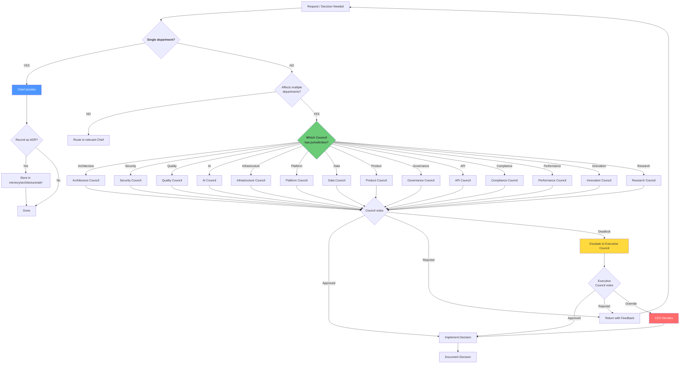

# Decision Flow — Cosca Governance

```mermaid
flowchart TD
    Req[Request / Decision Needed] --> Single{<b>Single department?</b>}
    Single -->|YES| Chief[Chief decides]
    Single -->|NO| Multiple{Affects multiple<br/>departments?}
    
    Multiple -->|NO| RT[Route to relevant Chief]
    Multiple -->|YES| Council{<b>Which Council<br/>has jurisdiction?</b>}
    
    Council -->|Architecture| ArchC[Architecture Council]
    Council -->|Security| SecC[Security Council]
    Council -->|Quality| QualC[Quality Council]
    Council -->|AI| AIC[AI Council]
    Council -->|Infrastructure| InfraC[Infrastructure Council]
    Council -->|Platform| PlatC[Platform Council]
    Council -->|Data| DataC[Data Council]
    Council -->|Product| ProdC[Product Council]
    Council -->|Governance| GovC[Governance Council]
    Council -->|API| APIC[API Council]
    Council -->|Compliance| CompC[Compliance Council]
    Council -->|Performance| PerfC[Performance Council]
    Council -->|Innovation| InnoC[Innovation Council]
    Council -->|Research| ResC[Research Council]
    
    ArchC --> Vote{Council votes}
    SecC --> Vote
    QualC --> Vote
    AIC --> Vote
    InfraC --> Vote
    PlatC --> Vote
    DataC --> Vote
    ProdC --> Vote
    GovC --> Vote
    APIC --> Vote
    CompC --> Vote
    PerfC --> Vote
    InnoC --> Vote
    ResC --> Vote
    
    Vote -->|Approved| Impl[Implement Decision]
    Vote -->|Rejected| Feedback[Return with Feedback]
    Vote -->|Deadlock| ExecC[Escalate to Executive Council]
    
    ExecC --> ExecVote{Executive<br/>Council votes}
    ExecVote -->|Approved| Impl
    ExecVote -->|Rejected| Feedback
    ExecVote -->|Override| CEO[CEO Decides]
    CEO --> Impl
    
    Chief --> ADR{Record as ADR?}
    ADR -->|Yes| StoreADR[Store in memory/architecture/adr/]
    ADR -->|No| Done[Done]
    
    Impl --> Record[Document Decision]
    Feedback --> Req
    StoreADR --> Done
    
    style CEO fill:#ff6b6b,color:#fff
    style ExecC fill:#ffd93d
    style Council fill:#6bcb77
    style Chief fill:#4d96ff,color:#fff
```

## Related
- [COUNCILS.md](../councils/COUNCILS.md) — Council definitions and membership
- [ORGCHART.md](../company/ORGCHART.md) — Decision authority matrix
