# Execution Pipeline — Cosca Runtime

```mermaid
flowchart LR
    Req((Request))
    
    subgraph Init[Initialization Phase]
        direction TB
        BS[Bootstrap<br/>Initialize Runtime]
        Disc[Discovery<br/>Scan Workspace]
        Ctx[Context<br/>Load Context]
        Mem[Memory<br/>Load Memories]
    end
    
    subgraph Plan[Planning Phase]
        direction TB
        Cap[Capability<br/>Resolution]
        WF[Workflow<br/>Selection]
        PlanG[Plan<br/>Generation]
        DAG[DAG<br/>Generation]
    end
    
    subgraph Exec[Execution Phase]
        direction TB
        Sched[Scheduler<br/>Queue & Dispatch]
        ExecE[Execution<br/>Run Steps]
        Rev[Review<br/>Gate 2 Checks]
        QA[Quality<br/>Gate Scoring]
    end
    
    subgraph Deliver[Delivery Phase]
        direction TB
        Doc[Documentation<br/>Update Docs]
        KStore[Knowledge Store<br/>Save Learnings]
        Del[Delivery<br/>Return Result]
    end
    
    Req --> BS
    BS --> Disc
    Disc --> Ctx
    Ctx --> Mem
    Mem --> Cap
    Cap --> WF
    WF --> PlanG
    PlanG --> DAG
    
    DAG --> Sched
    Sched --> ExecE
    ExecE --> Rev
    Rev --> QA
    
    QA --> Doc
    Doc --> KStore
    KStore --> Del
    Del --> Done((Done))
    
    %% Quality Gates
    G0[Gate 0<br/>Pre-Work] -..- BS
    G1[Gate 1<br/>Pre-Impl] -..- PlanG
    G2[Gate 2<br/>Post-Impl] -..- Rev
    G3[Gate 3<br/>Pre-Release] -..- QA
    G4[Gate 4<br/>Post-Release] -..- Del
    
    style G0 fill:#ff6b6b,color:#fff
    style G1 fill:#ffd93d
    style G2 fill:#6bcb77
    style G3 fill:#4d96ff,color:#fff
    style G4 fill:#845ef7,color:#fff
    style Req fill:#f0f0f0
    style Done fill:#f0f0f0
```

## Phase Details

| Phase | Duration | Quality Gate | Owner |
|-------|----------|-------------|-------|
| Init | 5-30s | Gate 0 | Kernel |
| Planning | 10-60s | Gate 1 | CTO |
| Execution | 1min-5d | Gate 2 | Department Chiefs |
| Delivery | 1-30min | Gate 3-4 | Release Chief |

## Related
- [KERNEL.md](../KERNEL.md) — Complete runtime specification
- [QUALITY_GATES.md](../QUALITY_GATES.md) — Gate definitions
