# Organizational Hierarchy — Cosca 40 Chiefs

```mermaid
graph TB
    User((User))
    CEO[CEO]
    CTO[CTO]
    Prod[Product Chief]
    UX[UI/UX Chief]
    Arch[Architecture Chief]
    BE[Backend Chief]
    FE[Frontend Chief]
    DB[Database Chief]
    Infra[Infrastructure Chief]
    API[API Chief]
    Cache[Cache Chief]
    Msg[Messaging Chief]
    Mig[Migration Chief]
    Disc[Discovery Chief]
    Perf[Performance Chief]
    DevOps[DevOps Chief]
    Sec[Security Chief]
    Prov[Provider Chief]
    QA[QA Chief]
    Test[Testing Chief]
    TDebt[Technical Debt Chief]
    Rev[Review Chief]
    Docs[Documentation Chief]
    Plat[Platform Chief]
    Plug[Plugin Chief]
    CLI[CLI Chief]
    SDK[SDK Chief]
    Mobile[Mobile Chief]
    AI[AI Chief]
    Ana[Analytics Chief]
    RT[Runtime Chief]
    WF[Workflow Chief]
    Int[Integrations Chief]
    Mon[Monitoring Chief]
    Rel[Release Chief]
    Auto[Automation Chief]
    Mem[Memory Chief]
    Ctx[Context Chief]
    Comp[Compliance Chief]
    Gov[Governance Chief]

    User --> CEO
    CEO --> Prod
    CEO --> CTO
    CEO --> Gov
    Prod --> UX
    CTO --> Arch
    CTO --> DevOps
    CTO --> Sec
    CTO --> QA
    CTO --> Rev
    CTO --> Docs
    CTO --> Plat
    CTO --> Mobile
    CTO --> AI
    CTO --> Ana
    CTO --> RT
    CTO --> WF
    CTO --> Int
    CTO --> Mon
    CTO --> Rel
    CTO --> Auto
    CTO --> Mem
    CTO --> Ctx
    CTO --> Comp
    CTO --> TDebt
    Arch --> BE
    Arch --> FE
    Arch --> DB
    Arch --> Infra
    Arch --> API
    Arch --> Cache
    Arch --> Msg
    Arch --> Mig
    Arch --> Disc
    Arch --> Perf
    QA --> Test
    Sec --> Prov
    Plat --> Plug
    Plat --> CLI
    Plat --> SDK
```

## Legend

- **Bold** = Executive / Layer Chiefs
- Normal = Department Chiefs
- Solid lines = Direct reporting
- Dashed lines = Matrix reporting

## Related
- [ORGCHART.md](../company/ORGCHART.md) — Detailed organizational chart
