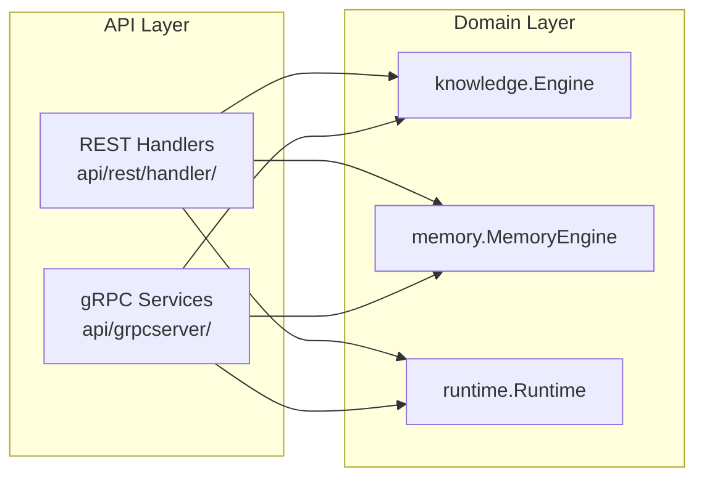

# gRPC Server Implementation Plan — Cosca v1.4.0-dev

**Status**: PLANNING  
**Author**: Architecture Chief + Backend Chief  
**Date**: 2026-07-28  
**Proto version**: protoc-gen-go-grpc v1.5.1, protoc v3.21.12  

---

## 1. Executive Summary

Adicionar um servidor gRPC ao Cosca que exponha os mesmos serviços da REST API,
compartilhando as engines subjacentes (`knowledge.Engine`, `memory.MemoryEngine`,
`runtime.Runtime`). O servidor gRPC rodará na mesma porta ou em porta separada,
dependendo da configuração.

**Escopo**: 3 serviços, 12 RPCs (todos unários, sem streaming).

> **Nota sobre a contagem**: O Don mencionou 15 RPCs, mas os 3 arquivos `.proto`
> definem 12 RPCs (4 Knowledge + 6 Memory + 2 Runtime). Os 3 RPCs adicionais
> podem ser futuras adições (ex.: `KnowledgeService/Delete`, `RuntimeService/Reload`, etc.).
> O plano cobre os 12 existentes e reserva slots para extensão.

---

## 2. Status Atual dos Artefatos Proto

### 2.1. Arquivos Gerados

| Arquivo | Localização | Conteúdo |
|---------|-------------|----------|
| `knowledge_grpc.pb.go` | `proto/aos/v1/` | Server/client interfaces + registrations |
| `knowledge.pb.go` | `proto/aos/v1/` | Message types (SearchRequest, IndexRequest, ...) |
| `memory_grpc.pb.go` | `proto/aos/v1/` | Server/client interfaces + registrations |
| `memory.pb.go` | `proto/aos/v1/` | Message types (StoreRequest, GetRequest, ...) |
| `runtime_grpc.pb.go` | `proto/aos/v1/` | Server/client interfaces + registrations |
| `runtime.pb.go` | `proto/aos/v1/` | Message types (StatusRequest, HealthRequest, ...) |

**Pacote Go**: `aospb` (conforme `go_package = "github.com/CoscaAI/cosca/api/grpc/pb;aospb"`)

**Problema de localização**: Os arquivos estão em `proto/aos/v1/` mas o `go_package`
indica `api/grpc/pb/`. Isso causa inconsistência — o import path seria
`github.com/CoscaAI/cosca/proto/aos/v1` (não `/api/grpc/pb`). **Recomendação**:
mover os 6 `.pb.go` para `api/grpc/pb/` para alinhar com o `go_package`.

### 2.2. Dependências Já Presentes

```
google.golang.org/grpc v1.64.0       ← ✓ no go.mod
google.golang.org/protobuf v1.33.0   ← ✓ no go.mod
google.golang.org/genproto/googleapis/rpc v0.0.0-20240318140521-94a12d6c2237 ← ✓ indireta
golang.org/x/net v0.56.0             ← ✓ indireta (necessária para gRPC)
```

**Não há necessidade de novas dependências.**

---

## 3. Estrutura de Diretórios Proposta

```
api/
├── grpc/
│   └── pb/                          ← mover proto/aos/v1/*.pb.go para cá
│       ├── knowledge.pb.go
│       ├── knowledge_grpc.pb.go
│       ├── memory.pb.go
│       ├── memory_grpc.pb.go
│       ├── runtime.pb.go
│       └── runtime_grpc.pb.go
├── middleware/
│   └── ...                          ← existente (HTTP-only, não reutilizável no gRPC)
├── rest/
│   ├── handler/
│   │   └── ...                      ← existente (HTTP handlers)
│   └── server.go                    ← existente (HTTP server)
└── grpcserver/                      ← NOVO: camada de servidor gRPC
    ├── server.go                    ← GRPCServer struct, Start/Shutdown
    ├── interceptors.go              ← logging, recovery, auth (unary interceptors)
    ├── knowledge_service.go         ← implementa KnowledgeServiceServer
    ├── memory_service.go            ← implementa MemoryServiceServer
    ├── runtime_service.go           ← implementa RuntimeServiceServer
    ├── mapping_knowledge.go         ← funções de mapeamento pb ↔ domain
    ├── mapping_memory.go            ← funções de mapeamento pb ↔ domain
    ├── mapping_runtime.go           ← funções de mapeamento pb ↔ domain
    ├── server_test.go               ← testes de integração do servidor
    ├── knowledge_service_test.go    ← testes unitários KnowledgeService
    ├── memory_service_test.go       ← testes unitários MemoryService
    └── runtime_service_test.go      ← testes unitários RuntimeService
```

**Arquivos de proto fonte** (`proto/aos/v1/*.proto`) permanecem onde estão
— são a fonte da verdade.

### Justificativa

| Decisão | Razão |
|---------|-------|
| `api/grpcserver/` em vez de `api/grpc/server/` | Evita conflito com `api/grpc/pb/` que contém código gerado. Separação clara entre código gerado e implementação. |
| Arquivos de mapeamento separados (`mapping_*.go`) | Mantém os service implementations limpos — apenas lógica de orquestração. Facilita testes unitários dos mapeamentos. |
| `interceptors.go` separado | Interceptors gRPC são conceitualmente diferentes dos middlewares HTTP. Não se reutilizam. |
| `.pb.go` movidos para `api/grpc/pb/` | Alinha com o `go_package` do proto. Evita imports com caminho `proto/aos/v1`. |

---

## 4. Mapeamento RPC → Handler → Service Layer

### 4.1. KnowledgeService (4 RPCs)

| RPC | Proto Request | Proto Response | Engine Method | Notas |
|-----|---------------|----------------|---------------|-------|
| `Search` | `SearchRequest` | `SearchResponse` | `ke.Search(ctx, search.SearchParams)` | Conversão: pb.SearchRequest → search.SearchParams. Resultados → pb.SearchResult[] |
| `Index` | `IndexRequest` | `IndexResponse` | `ke.IndexDocument(ctx, path)` ou `ke.IndexDirectory(ctx, path)` | Se `recursive=true` → IndexDirectory, senão IndexDocument. O engine não retorna contagem de chunks; estimar ou deixar 0. |
| `Stats` | `StatsRequest` (vazio) | `StatsResponse` | `ke.GetStats()` | Mapeamento direto dos campos de knowledge.Stats. Campos `entity_count` e `vector_count` já existem em Stats. |
| `Sync` | `SyncRequest` (vazio) | `SyncResponse` | `ke.Sync(ctx)` | Mapear `SyncResult.Added/Updated/Removed` para contagens (len()). `Errors` mapeado diretamente. |

### 4.2. MemoryService (6 RPCs)

| RPC | Proto Request | Proto Response | Engine Method | Notas |
|-----|---------------|----------------|---------------|-------|
| `Store` | `StoreRequest` | `StoreResponse` | `mem.Store(ctx, MemoryRecord)` | Construir `memory.MemoryRecord` a partir do pb. TTL em string ("1h", "30m") → `time.ParseDuration()`. |
| `Search` | `MemorySearchRequest` | `MemorySearchResponse` | `mem.Search(ctx, query, SearchOptions)` | Construir `memory.SearchOptions` com types, layers, limit. Resultados → `MemoryRecord[]`. |
| `Get` | `GetRequest` | `GetResponse` | `mem.Retrieve(ctx, id, layer)` | Mapeamento 1:1. Se record não encontrado, retornar `codes.NotFound`. |
| `Delete` | `DeleteRequest` | `DeleteResponse` | `mem.Delete(ctx, id, layer)` | Mapeamento 1:1. `success=true` se não houver erro. |
| `Promote` | `PromoteRequest` | `PromoteResponse` | `mem.Promote(ctx, id, from, to)` | Mapeamento 1:1. Retorna o record promovido. |
| `Stats` | `MemoryStatsRequest` | `MemoryStatsResponse` | `mem.GetLayerStats(ctx)` | Mapear `map[MemoryLayer]LayerStats` → `map[string]*LayerStats`. `LayerStats.Count` → `RecordCount`, `LayerStats.TotalSize` → `SizeBytes`. |

### 4.3. RuntimeService (2 RPCs)

| RPC | Proto Request | Proto Response | Engine Method | Notas |
|-----|---------------|----------------|---------------|-------|
| `Status` | `StatusRequest` (vazio) | `StatusResponse` | `rt.State().Get()`, `rt.HealthReport()`, `rt.Config()` | Extrair state, health, uptime, version, components do runtime. |
| `Health` | `HealthRequest` (vazio) | `HealthResponse` | `rt.Health()` | `healthy=true` se Health() == StatusHealthy ou StatusUnknown. Warnings dos componentes degradados. |

---

## 5. Interface de Cada Handler gRPC

Cada serviço implementa a interface gerada pelo protoc e embute o `Unimplemented*Server`:

```go
// api/grpcserver/knowledge_service.go
type KnowledgeServiceServer struct {
    aospb.UnimplementedKnowledgeServiceServer  // embutido por valor (requerido)
    engine *knowledge.Engine
}

func NewKnowledgeServiceServer(engine *knowledge.Engine) *KnowledgeServiceServer {
    return &KnowledgeServiceServer{engine: engine}
}

func (s *KnowledgeServiceServer) Search(ctx context.Context, req *aospb.SearchRequest) (*aospb.SearchResponse, error) {
    // 1. Validar request (query não-vazia? limite > 0?)
    // 2. Converter pb.SearchRequest → search.SearchParams
    // 3. Chamar s.engine.Search(ctx, params)
    // 4. Converter search.SearchResults → pb.SearchResponse
    // 5. Retornar resposta ou erro gRPC
}
```

### Padrão de erro

Usar `status.Errorf(codes.*, "mensagem")` para erros gRPC:

| Situação | Código gRPC |
|----------|-------------|
| Request inválido (parâmetros ausentes) | `codes.InvalidArgument` |
| Engine não inicializado | `codes.FailedPrecondition` |
| Recurso não encontrado | `codes.NotFound` |
| Erro interno do engine | `codes.Internal` |
| Operação bem-sucedida | (nil error) |

---

## 6. Estratégia DRY — Compartilhamento com REST

### Situação atual

A REST API **não possui camada de serviço** — os handlers HTTP chamam diretamente
os métodos das engines:

```
REST Handler → knowledge.Engine.Search()
REST Handler → memory.MemoryEngine.Store()
REST Handler → runtime.Runtime.Health()
```

### Estratégia para o gRPC

**Manter o mesmo padrão**: os handlers gRPC também chamam diretamente as engines.
Isso é consistente com a arquitetura atual e evita introduzir uma camada de
abstração desnecessária neste momento.



**Única duplicação inevitável**: lógica de validação de entrada.
- REST: valida no handler via `json.Decoder` + checagens manuais
- gRPC: valida no service method + usa `codes.InvalidArgument`

Recomendação: **não extrair validação compartilhada agora**. A validação é
pequena (2-3 linhas por RPC) e difere entre JSON e protobuf. Se crescer, extrair
para funções `validate*()` em um package `internal/validation/`.

---

## 7. Inicialização do Servidor gRPC

### 7.1. Fluxo no `internal/cli/serve.go`

O servidor gRPC será inicializado **após** o servidor REST, **antes** de iniciar
os listeners:

```go
// ── Build gRPC server ──────────────────────────────────────────
grpcCfg := grpcserver.DefaultConfig()
grpcCfg.Port = *grpcPort  // nova flag --grpc-port (default: 14122)
grpcCfg.Reflection = true // dev apenas; production via flag

grpcSrv := grpcserver.New(ke, mem, rtInstance, grpcCfg)

// ── Start servers ──────────────────────────────────────────────
// REST server goroutine (existente)
go func() { ... }()

// gRPC server goroutine (NOVO)
go func() {
    logger.Info().Int("port", grpcCfg.Port).Msg("gRPC server listening")
    if err := grpcSrv.Serve(); err != nil {
        errCh <- fmt.Errorf("gRPC server: %w", err)
    }
}()
```

### 7.2. Novas flags no comando `serve`

| Flag | Default | Descrição |
|------|---------|-----------|
| `--grpc-port` | `14122` | Porta do servidor gRPC |
| `--grpc-reflection` | `false` | Habilita server reflection (dev) |
| `--grpc-disable` | `false` | Desabilita completamente o gRPC |

### 7.3. Graceful shutdown

Adicionar ao `select` de shutdown existente:

```go
// Shutdown gRPC server
grpcSrv.GracefulStop() // ou grpcSrv.Stop() para force shutdown
logger.Info().Msg("gRPC server stopped")
```

---

## 8. Interceptors (Middleware gRPC)

| Interceptor | Tipo | Descrição |
|-------------|------|-----------|
| `LoggingInterceptor` | Unary | Loga método, duração, status code (equivalente ao `LoggingMiddleware` REST) |
| `RecoveryInterceptor` | Unary | Recupera de panics, converte para `codes.Internal` |
| `AuthInterceptor` | Unary | **Fase 2** — valida JWT token do metadata (equivalente ao `auth.Middleware` REST) |

**Fase 1** (MVP): Apenas `LoggingInterceptor` e `RecoveryInterceptor`.
Autenticação fica para fase 2 — gRPC exposto em rede interna ou localhost.

---

## 9. Mapeamento de Tipos (pb ↔ domain)

### 9.1. Knowledge

```go
// mapping_knowledge.go

// pb → domain
func pbToSearchParams(req *aospb.SearchRequest) search.SearchParams { ... }

// domain → pb
func searchResultsToPb(sr *search.SearchResults) *aospb.SearchResponse { ... }
func statsToPb(stats *knowledge.Stats) *aospb.StatsResponse { ... }
func syncResultToPb(result *knowledge.SyncResult) *aospb.SyncResponse { ... }
```

### 9.2. Memory

```go
// mapping_memory.go

// pb → domain
func pbToMemoryRecord(req *aospb.StoreRequest) memory.MemoryRecord { ... }
func pbToSearchOptions(req *aospb.MemorySearchRequest) memory.SearchOptions { ... }

// domain → pb
func memoryRecordToPb(rec memory.MemoryRecord) *aospb.MemoryRecord { ... }
func memoryRecordsToPb(recs []memory.MemoryRecord) []*aospb.MemoryRecord { ... }
func layerStatsToPb(stats map[memory.MemoryLayer]memory.LayerStats) *aospb.MemoryStatsResponse { ... }
```

### 9.3. Runtime

```go
// mapping_runtime.go

// domain → pb
func runtimeStatusToPb(rt *runtime.Runtime) *aospb.StatusResponse { ... }
func runtimeHealthToPb(rt *runtime.Runtime) *aospb.HealthResponse { ... }
```

### Cuidados de mapeamento

- **TTL**: Proto usa `string` ("1h", "30m"). Fazer `time.ParseDuration()`. Se inválido, usar default do engine.
- **Campos opcionais**: Campos `optional` no proto viram ponteiros no Go. Tratar nil.
- **Timestamps**: Proto usa `string` (RFC3339). Converter via `time.Format(time.RFC3339)`.
- **Enums**: Proto não define enums para Type/Layer. São strings. Validar contra constantes do domain (`memory.MemoryType`, `memory.MemoryLayer`).
- **Priority**: Proto usa `int32`. Domain usa `int`. Conversão segura em ambos os sentidos.

---

## 10. Plano de Testes

### 10.1. Testes Unitários — Mapeamentos

- **O que**: Testar cada função de mapeamento (`pbToSearchParams`, `searchResultsToPb`, etc.)
- **Como**: Criar structs pb de entrada, verificar structs domain de saída, e vice-versa
- **Cobertura**: 100% das funções de mapeamento
- **Arquivos**: `mapping_knowledge_test.go`, `mapping_memory_test.go`, `mapping_runtime_test.go`

### 10.2. Testes Unitários — Service Implementations

- **O que**: Testar cada método de serviço com engine mockada
- **Como**: Criar mock das engines (interfaces ou stubs), injetar no service, verificar resposta
- **Cobertura**: 1 caso feliz + 1 caso de erro por RPC
- **Arquivos**: `knowledge_service_test.go`, `memory_service_test.go`, `runtime_service_test.go`

### 10.3. Testes de Integração — Servidor

- **O que**: Iniciar servidor gRPC real, conectar com cliente, chamar RPCs
- **Como**: Usar `bufconn` (in-memory connection) para evitar bind de porta
- **Cobertura**: Fluxo completo de 2-3 RPCs por serviço
- **Arquivo**: `server_test.go`

### 10.4. Teste de Integração — Graceful Shutdown

- **O que**: Verificar que `GracefulStop()` não causa data race e completa corretamente
- **Arquivo**: `server_test.go`

---

## 11. Estimativa de Esforço

| Etapa | Tarefas | Esforço |
|-------|---------|---------|
| **FASE 0** — Setup | Mover .pb.go para `api/grpc/pb/`, ajustar imports, verificar compilação | 30 min |
| **FASE 1** — RuntimeService | `runtime_service.go` + `mapping_runtime.go` + testes | 1.5h |
| **FASE 2** — KnowledgeService | `knowledge_service.go` + `mapping_knowledge.go` + testes | 2.5h |
| **FASE 3** — MemoryService | `memory_service.go` + `mapping_memory.go` + testes | 3h |
| **FASE 4** — Server + Interceptors | `server.go` + `interceptors.go` + integração no `serve.go` | 2h |
| **FASE 5** — Testes de Integração | `server_test.go` com bufconn, graceful shutdown | 2h |
| **FASE 6** — Polimento | Revisão, edge cases, nil safety, documentação | 1.5h |
| **TOTAL** | | **~12.5h** |

---

## 12. Ordem de Implementação Recomendada

```
FASE 0: Setup (mover .pb.go, compilar)
    ↓
FASE 1: RuntimeService (mais simples, 2 RPCs, serve como template)
    ↓
FASE 4: Server + Interceptors (infraestrutura do servidor)
    ↓
FASE 2: KnowledgeService (4 RPCs, complexidade média)
    ↓
FASE 3: MemoryService (6 RPCs, mais complexo — tipos de memória, TTL, promote)
    ↓
FASE 5: Testes de Integração (quando todos os serviços estão prontos)
    ↓
FASE 6: Polimento
```

**Justificativa da ordem**:
1. **Runtime primeiro** — apenas 2 RPCs, sem dependências complexas, serve
   como prova de conceito e template para os demais serviços.
2. **Server em paralelo** — assim que Runtime funciona, construir a infra
   do servidor para testar end-to-end.
3. **Knowledge depois** — 4 RPCs, mapeamento moderado, valida dependências de search.
4. **Memory por último** — 6 RPCs, mais tipos de dados, TTL parsing, Promote
   com snapshots, edge cases (layer inexistente, record expirado).

---

## 13. Dependências e Bloqueios

### 13.1. O que já existe e pode ser REUTILIZADO

| Recurso | Localização | Status |
|---------|-------------|--------|
| Proto compilado (.pb.go) | `proto/aos/v1/` | ✅ Gerado, compila |
| Dependências gRPC/Protobuf | `go.mod` | ✅ v1.64.0 / v1.33.0 |
| `knowledge.Engine` | `internal/knowledge/` | ✅ API estável, 6 métodos públicos |
| `memory.MemoryEngine` | `internal/memory/` | ✅ API estável, 7 métodos públicos |
| `runtime.Runtime` | `internal/runtime/` | ✅ API estável |
| REST handlers (referência) | `api/rest/handler/` | ✅ Mapeamentos JSON → domain já implementados |
| Sistema de graceful shutdown | `internal/cli/serve.go` | ✅ Padrão com signal handling e errCh |
| Logger (zerolog) | `internal/cli/serve.go` | ✅ Já configurado |

### 13.2. O que precisa ser CRIADO do zero

| Recurso | Descrição |
|---------|-----------|
| `api/grpcserver/server.go` | Struct do servidor gRPC, `New()`, `Serve()`, `GracefulStop()` |
| `api/grpcserver/interceptors.go` | Logging + recovery interceptors |
| `api/grpcserver/knowledge_service.go` | Implementação de `KnowledgeServiceServer` |
| `api/grpcserver/memory_service.go` | Implementação de `MemoryServiceServer` |
| `api/grpcserver/runtime_service.go` | Implementação de `RuntimeServiceServer` |
| `api/grpcserver/mapping_*.go` (3 arquivos) | Funções de mapeamento pb ↔ domain |
| `api/grpcserver/*_test.go` (7 arquivos) | Testes unitários + integração |

### 13.3. O que precisa ser MODIFICADO

| Arquivo | Modificação |
|---------|-------------|
| `internal/cli/serve.go` | Adicionar flag `--grpc-port`, inicialização do `grpcserver.New()`, goroutine do servidor, graceful shutdown |
| `proto/aos/v1/*.pb.go` | **Mover** 6 arquivos para `api/grpc/pb/` |
| Arquivos que importam `proto/aos/v1` | Atualizar import paths (se existirem) |

### 13.4. Serviços REST equivalentes (referência para mapeamento)

| gRPC RPC | REST Endpoint | REST Handler |
|----------|---------------|--------------|
| `KnowledgeService/Search` | `POST /v1/knowledge/search` | `handler.KnowledgeHandler.Search()` |
| `KnowledgeService/Index` | `POST /v1/knowledge/index` | `handler.KnowledgeHandler.Index()` |
| `KnowledgeService/Stats` | `GET /v1/knowledge/stats` | `handler.KnowledgeHandler.Stats()` |
| `KnowledgeService/Sync` | `POST /v1/knowledge/sync` | `handler.KnowledgeHandler.Sync()` |
| `MemoryService/Store` | `POST /v1/memory/store` | `handler.MemoryHandler.Store()` |
| `MemoryService/Search` | `GET /v1/memory/search` | `handler.MemoryHandler.Search()` |
| `MemoryService/Get` | `GET /v1/memory/get` | `handler.MemoryHandler.Get()` |
| `MemoryService/Delete` | `DELETE /v1/memory/delete` | `handler.MemoryHandler.Delete()` |
| `MemoryService/Promote` | `POST /v1/memory/promote` | `handler.MemoryHandler.Promote()` |
| `MemoryService/Stats` | `GET /v1/memory/stats` | `handler.MemoryHandler.Stats()` |
| `RuntimeService/Status` | `GET /v1/status` | `handler.RuntimeHandler.Status()` |
| `RuntimeService/Health` | `GET /v1/health` | `handler.RuntimeHandler.Health()` |

---

## 14. Decisões Arquiteturais (ADRs implícitas)

### ADR-001: gRPC em porta separada

**Decisão**: Servidor gRPC roda em porta dedicada (`--grpc-port`, default 14122),
não compartilhando porta com HTTP.

**Justificativa**:
- Simplicidade de implementação (evita multiplexação HTTP/gRPC no mesmo listener)
- O Go standard library `net/http` não suporta h2c nativamente bem
- Separação clara para firewalls e service mesh (Istio/Linkerd)
- Possibilidade futura de usar [cmux](https://github.com/soheilhy/cmux) se necessário

**Alternativa considerada**: Multiplexar HTTP/1.1 + gRPC na mesma porta (14120)
via `http.Handler` + `grpc.Server` com detecção de Content-Type.
Rejeitada por complexidade e edge cases com TLS.

### ADR-002: Sem camada de serviço intermediária

**Decisão**: Não introduzir uma camada de "application service" entre handlers
(gRPC e REST) e as engines.

**Justificativa**:
- Consistente com a arquitetura atual (REST handlers chamam engines diretamente)
- Evita abstração prematura
- A lógica de negócio já reside nas engines (`knowledge.Engine`, `memory.MemoryEngine`)
- Se necessário no futuro, refatorar para extrair services é trivial (as engines já são a service layer)

### ADR-003: Mapeamentos pb ↔ domain em arquivos separados

**Decisão**: Cada serviço tem um arquivo `mapping_<domain>.go` dedicado exclusivamente
à conversão de tipos.

**Justificativa**:
- Service implementations ficam focadas em orquestração (validar → converter → chamar engine → converter → responder)
- Mapeamentos são testáveis isoladamente
- Facilita manutenção quando o proto evoluir

### ADR-004: Proto files movidos para `api/grpc/pb/`

**Decisão**: Mover os arquivos `.pb.go` de `proto/aos/v1/` para `api/grpc/pb/`.

**Justificativa**:
- Alinha com o `go_package` definido nos `.proto`
- Import path canônico: `github.com/CoscaAI/cosca/api/grpc/pb`
- Separa código gerado (não editável) do código fonte proto (editável)
- Convenção Go: código gerado fica próximo de quem o consome

---

## 15. Riscos e Mitigações

| Risco | Prob. | Impacto | Mitigação |
|-------|-------|---------|-----------|
| `knowledge.Engine` não inicializado no momento da chamada gRPC | Média | Alto | Verificar `ke != nil` antes de criar o service. Retornar `codes.FailedPrecondition` se nil. |
| `memory.MemoryEngine.Delete` não lança erro se registro não existe | Baixa | Médio | Handler REST atual verifica com Retrieve antes de Delete. Adotar mesmo padrão no gRPC. |
| Data race no acesso às engines durante graceful shutdown | Baixa | Alto | Usar `sync.RWMutex` (engines já têm internamente). Ordem de shutdown: 1) gRPC server GracefulStop, 2) REST server Shutdown, 3) engines Close. |
| TTL parsing falha com strings não-standard | Baixa | Baixo | Usar `time.ParseDuration()`. Se falhar, logar warning e usar default TTL do engine. |
| Server reflection vaza informação em produção | Média | Médio | Habilitar apenas com flag `--grpc-reflection` (default false). Documentar risco. |

---

## 16. Próximos Passos (pós-planejamento)

1. **[ ]** Aprovação do plano pelo Don/CTO
2. **[ ]** Executar FASE 0: Mover `.pb.go` e verificar compilação
3. **[ ]** Executar FASE 1: Implementar RuntimeService como template
4. **[ ]** Criar ADR formal em `.opencode/cosca/memory/architecture/adr/grpc-server.md`
5. **[ ]** Revisar com Backend Chief e QA Chief após FASE 1 concluída
6. **[ ]** Proceder com FASES 2-6

---

## Apêndice A: Assinaturas das Interfaces Geradas

```go
// KnowledgeServiceServer (4 métodos)
type KnowledgeServiceServer interface {
    Search(context.Context, *SearchRequest) (*SearchResponse, error)
    Index(context.Context, *IndexRequest) (*IndexResponse, error)
    Stats(context.Context, *StatsRequest) (*StatsResponse, error)
    Sync(context.Context, *SyncRequest) (*SyncResponse, error)
    mustEmbedUnimplementedKnowledgeServiceServer()
}

// MemoryServiceServer (6 métodos)
type MemoryServiceServer interface {
    Store(context.Context, *StoreRequest) (*StoreResponse, error)
    Search(context.Context, *MemorySearchRequest) (*MemorySearchResponse, error)
    Get(context.Context, *GetRequest) (*GetResponse, error)
    Delete(context.Context, *DeleteRequest) (*DeleteResponse, error)
    Promote(context.Context, *PromoteRequest) (*PromoteResponse, error)
    Stats(context.Context, *MemoryStatsRequest) (*MemoryStatsResponse, error)
    mustEmbedUnimplementedMemoryServiceServer()
}

// RuntimeServiceServer (2 métodos)
type RuntimeServiceServer interface {
    Status(context.Context, *StatusRequest) (*StatusResponse, error)
    Health(context.Context, *HealthRequest) (*HealthResponse, error)
    mustEmbedUnimplementedRuntimeServiceServer()
}
```

## Apêndice B: Engine Methods Disponíveis

```go
// knowledge.Engine
func (e *Engine) Search(ctx context.Context, params search.SearchParams) (*search.SearchResults, error)
func (e *Engine) IndexDocument(ctx context.Context, path string) error
func (e *Engine) IndexDirectory(ctx context.Context, dir string) error
func (e *Engine) GetStats() (*Stats, error)
func (e *Engine) Sync(ctx context.Context) (*SyncResult, error)
func (e *Engine) Close() error

// memory.MemoryEngine
func (e *MemoryEngine) Store(ctx context.Context, record MemoryRecord) (*MemoryRecord, error)
func (e *MemoryEngine) Retrieve(ctx context.Context, id string, layer MemoryLayer) (*MemoryRecord, error)
func (e *MemoryEngine) Delete(ctx context.Context, id string, layer MemoryLayer) error
func (e *MemoryEngine) Search(ctx context.Context, query string, opts SearchOptions) ([]MemoryRecord, error)
func (e *MemoryEngine) Promote(ctx context.Context, id string, from, to MemoryLayer) (*MemoryRecord, error)
func (e *MemoryEngine) GetLayerStats(ctx context.Context) map[MemoryLayer]LayerStats
func (e *MemoryEngine) Close() error

// runtime.Runtime
func (r *Runtime) Health() ComponentStatus
func (r *Runtime) State() *RuntimeState
func (r *Runtime) HealthReport() map[string]interface{}
func (r *Runtime) Config() RuntimeConfig
func (r *Runtime) Start(ctx context.Context) error
func (r *Runtime) Stop(ctx context.Context) error
```

---

*Plano gerado por Architecture Chief (cosca-architecture) + Backend Chief (cosca-backend)*
*Versão do plano: 1.0 — 2026-07-28*
