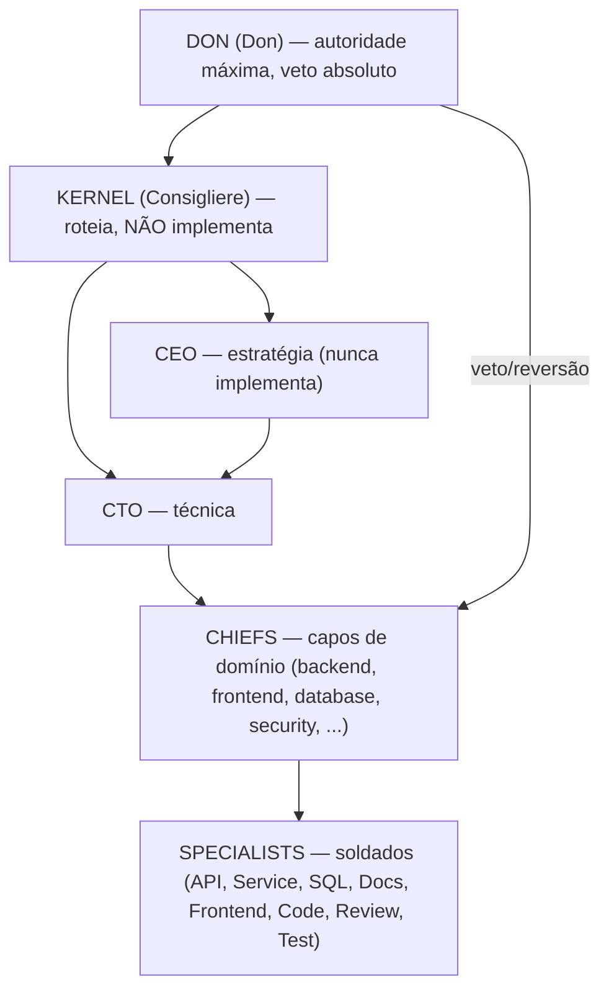
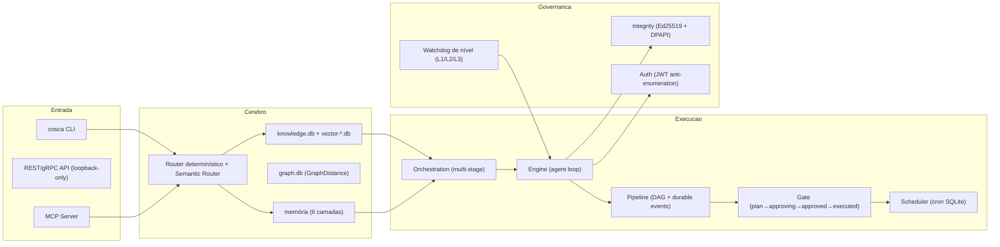

# COSCA — Prova Documental de Capacidade

> **Data**: 2026-09-05
> **Autor**: Cosca Kernel e Technical Writer (por ordem do Don)
> **Versão do sistema avaliada**: 1.5.0 (build `go1.26.7 windows/amd64`, commit `unknown`)
> **Status**: Carteira de identidade da plataforma — **não é um anúncio**.
> **Princípio** (Lei da Família): Honestidade > Lealdade > Confiança. Nenhum número foi inventado. Onde um valor varia entre fontes, a discrepância é declarada e o valor **verificado por medição** nesta sessão é apresentado como referência.
> **Escopo**: o que o código executa hoje. Claims históricos estão marcados como `[documentado]`; fatos medidos nesta sessão estão marcados como `[medido 2026-09-05]`.

---

## 0. Como ler este documento

Este documento separa **três categorias de informação**, para nunca confundir propaganda com fato:

| Marca | Significado | Você pode confiar por quê |
|-------|-------------|---------------------------|
| `[medido 2026-09-05]` | Foi executado e medido **nesta sessão de verificação** | Eu rodei o comando e li o output |
| `[documentado]` | Está escrito em um arquivo do repositório | Foi registrado por alguém, em algum momento |
| `[reconciliação]` | Onde fontes divergem, com o valor adotado | Método de arbitragem explicitado |

**Regra do P2 (Constituição):** o código executado é a verdade absoluta. Quando o README, o CHANGELOG e o CLI discordam, o CLI é a autoridade — e a divergência é reportada, não escondida.

---

## 1. Sumário executivo honesto

**O que o COSCA é**: uma **plataforma de orquestração de agentes de IA escrita em Go**. Não é um chatbot. O README declara textualmente:

> *"O Cosca não é um chatbot — é um sistema de orquestração de agentes com um cérebro de conhecimento curado. Ele decide onde procurar (router determinístico), recupera informação validada, e delega execução numa hierarquia operacional onde cada agente tem papel definido."* — `docs/README.md` / `README.md`

**O que está LIGADO e comprovado nesta sessão** (tudo `[medido 2026-09-05]`):

- **Conhecimento**: banco de 113.127.424 bytes (~107,9 MB), 1.965 arquivos indexados, 17.738 entries, 50.014 vetores. Busca híbrida **funcionando** — uma query real em português retornou 10 resultados.
- **Órgãos**: 8/8 órgãos do kernel operacionais (`kernel`, `runtime`, `knowledge`, `memory`, `trace`, `vision`, `cost`, `cli`), `allow_write=true`, `kernel_halted=false`.
- **Nível cognitivo**: **L2-raciocínio** (`cosca capability level`), provider ativo `ollama` (local).
- **Performance medida hoje**: fast path int8 AVX2 — **~57,5 Mvec/s** (dot 16×L3, 100k vetores, warmup estável) na medição desta sessão, com **0 alocações** no produto escalar. (Em cold-start sem aquecimento, ~31 Mvec/s — a diferença é documentada em §6.)
- **Framework de agentes**: 61 agentes listados, 88 skills, contados pelo CLI.

**O que está PARADO / NÃO comprovado / tem pendência** — a parte que um anúncio esconderia:

1. **Runtime daemon está PARADO.** `cosca doctor`: *Runtime Daemon PID file not found*, *Runtime is not active*, health `false`, estado `stopped`. O serviço `cosca serve` (loopback 127.0.0.1:14120) **não está rodando** neste momento.
2. **Nível é L2, não L3.** `autonomous_execution` está **✗ indisponível**. A execução autônoma (L3-SOBERANO) **não está ativa** — exige aval do Don via `VerifyDonPresence` (fail-closed).
3. **1 vulnerabilidade de dependência em aberto**: `golang.org/x/crypto/openpgp` (low/medium). O `cosca doctor` varreu 217 pacotes e achou 1.
4. **1 chunk do conhecimento sem vetor**: `cosca doctor` acusa *"1 integrity issues in knowledge base"* → precisa `cosca knowledge compile` para re-embed.
5. **Todas as 88 skills mostram "Uses: 0 / nunca usada"**: o catálogo está **provisionado**, mas o **uso real/benchmark por skill não foi acionado**.
6. **Sem sandbox no Windows.** bwrap indisponível → exige `COSCA_ALLOW_NO_ROOT=1` (opt-in declarado). E a re-assinatura via hook post-commit é **frágil no Windows** (semi-manual via `bin/cosca-check.exe --sign-auto`).

**Conclusão do sumário** (uma frase, verdadeira): o COSCA é um sistema de orquestração com um cérebro de conhecimento curado e busca híbrida **funcionando**, validado por testes e certificação GOLD, mas **hoje opera no nível L2 com o daemon parado**, com 1 vulnerabilidade e 1 chunk órfão — e o catálogo de skills ainda não tem uso medido.

---

## 2. Identidade e posicionamento

| Campo | Valor `[medido 2026-09-05]` |
|-------|------------------------------|
| Nome | Cosca — Enterprise AI Orchestration Platform |
| Natureza | Plataforma de **orquestração** de agentes de IA (não chatbot) |
| Linguagem | Go (`go1.26.7`, `windows/amd64`, `gc`) |
| Versão | 1.5.0 (commit `unknown` no binário `bin/cosca.exe`) |
| Projeto | `C:\Users\Henrique\Documents\cosca` |
| Modelo da sessão (este agente) | `deepseek/deepseek-v4-flash-vision-exp` |
| Provider ativo da plataforma | `ollama` (local) — `[medido]` via `cosca status` / `capability level` |
| Nível cognitivo atual | **L2-raciocínio** (runtime de execução: **não habilitado**) |
| Runtime daemon | **STOPPED** (health `false`) |

**Não é um framework genérico.** O README posiciona como: *"infraestrutura de produção com: conhecimento modular com proveniência (claims FACT/EVIDENCE/INFERENCE), memória semântica auto-evolutiva, quality gates, sandboxing, e chain de integridade Ed25519."*

**Distinção importante (honesta):** o modelo que "alimenta" a sessão de orquestração (este agente, no MCP) é `deepseek-v4-flash-vision-exp`. O **Model Registry da plataforma** (`cosca model list`) reportou nesta sessão: *"No models registered"* — ou seja, o registro de modelos está **vazio** no momento, embora a plataforma rode um provider ativo (`ollama`). Isso é uma lacuna declarada (ver §11).

---

## 3. Arquitetura

### 3.1 Cadeia de comando (contrato social)

A Constituição define a hierarquia. O KERNEL **roteia e nunca implementa** (Mandamentos I–III), delegando aos Chiefs que comandam os Specialists. Este é um contrato de organização, não um roteador simples.



> O KERNEL **não escreve código, não edita arquivos e não executa comandos destrutivos**. Ele planeja, roteia e revisa.

### 3.2 Runtime Platform spec (KERNEL.md v3.0.1)

O KERNEL é definido como uma **Runtime Platform**, não um router. Números da especificação (`[documentado]`, verificados no cabeçalho e na tabela de contingências de `documents/KERNEL.md v3.0.1`):

| Item | Valor |
|------|-------|
| Responsabilidades | 23 |
| Seções | 28 |
| State Machine | 14 estados (modelo formal DFA: `M = (S, Σ, δ, s₀, F)`, matrix de transição, guards) |
| Eventos | 80+ tipos em 14 grupos |
| DAG execution | 10 tipos de nó, 5 tipos de aresta, 20 regras de validação |
| Scheduler | 7 filas (+ dead letter, algoritmo de dispatch) |
| Contratos formais | 13 contratos, 71 regras de validação |
| Health | 3 probes; 12 dependências, 9 circuit breakers |
| Métricas | 125+ métricas em 13 categorias, 6 exporters |
| Feature flags | 28 (lifecycle de 6 fases, rollout gradual) |
| Multi-runtime | 8 perfis (compliance matrix) |

> **Reconciliação de tamanho do KERNEL.md** `[reconciliação]`: o changelog interno do documento (uma nota da revisão v2.0.0) registra *"Document grew from 189 to 12,125 lines"*. O arquivo **atual** `v3.0.1` (`.opencode/cosca/KERNEL.md`) tem **1.499 linhas**; a variante em `.cosca/framework/KERNEL.md` tem **1.577 linhas** (com o preâmbulo `DESPERTAR.md`). O número "~12.000 linhas" é **histórico** (da revisão v2.0.0), não o tamanho real do v3.0.1 atual. Marco isso abertamente.

### 3.3 Camadas do sistema (fluxo de dados)



### 3.4 Componentes da esteira (inventário do README, `[documentado]`)

| Componente | Pacote | Responsabilidade | Status documentado |
|------------|--------|------------------|--------------------|
| Engine | `internal/engine` | Agent loop com streaming, tool calling, subagentes | PASS |
| Pipeline | `internal/pipeline` | DAG executor com durable events, recovery, reconciliation | PASS |
| Orchestration | `internal/orchestration` | Multi-stage: knowledge→memory→routing→deliberation→LLM | PASS |
| Gate | `internal/gate` | Máquina de estados: plan→approving→approved→executed | PASS |
| Scheduler | `internal/scheduler` | Cron daemon com persistent store SQLite | PASS |
| Task | `internal/task` | Lifecycle: ACTIVE/WAITING/PAUSED/COMPLETE/ABORTED | PASS |
| Workflow | `internal/workflow` | Value-routing engine (Google ADK pattern) | PASS |
| Autonomy | `internal/autonomy` | Limites determinísticos + quality gates via shell | PASS |
| Dflow | `internal/dflow` | Temporal pattern: pure workflows + replay determinístico | PASS |
| Integrity | `internal/integrity` | Ed25519 + DPAPI machine-bound signing | PASS |
| Auth | `internal/auth` | JWT anti-enumeration + rotation | PASS |
| Orchestrator | `internal/orchestrator` | Task Continuation Loop (ADR-015) | PASS |
| Nodegraph | `internal/nodegraph` | Media pipeline graphs (ComfyUI pattern) | PASS |
| Workstate | `internal/workstate` | COW snapshot/restore de estado | PASS |
| Workflows | `internal/workflows` | Workflow management via markdown definitions | PASS |

---

## 4. Inventário quantificado — reconciliação de métricas

Esta é a seção onde a honestidade é mais importante. **Há dispersão histórica real** entre as fontes. A tabela abaixo lista cada fonte e o número que ela afirma, e mostra qual número foi adotado e por quê.

| Fonte | Agents | Skills | Workflows | Observação |
|-------|:------:|:------:|:---------:|------------|
| `README.md` (badge) | 53 | 29 | 30 | Também diz 843 testes, 1.867 Go files |
| `KERNEL.md` v3.0.1 (cabeçalho) | 54 | 43 | — | Diz "41 departments, 30+ engines" |
| `Platform Overview` (changelog 1.5.0) | 40 | 43 | 20 | Diz "40 agents, 43 skills, 20 workflows, 30 engines" |
| **CLI `cosca agent list` `[medido 2026-09-05]`** | **61** | — | — | Contagem real de linhas ativas |
| **CLI `cosca skill status` `[medido 2026-09-05]`** | — | **88** | — | *"Skills — 88 skill(s)"* |
| **Arquivos em disco `.opencode/cosca/` `[medido]`** | 106 (`.md`) | 98 (`.md`) | 30 (`.md`) | memories: 496 arquivos |
| `COSCA_ENTERPRISE_EVOLUTION.md` v4.0.0 | 40 | 43 | 20 | Claim do doc de evolução |

**`[reconciliação]` O que este documento adota como números verificados:**

- **61 agentes** — contados pelo CLI `cosca agent list` hoje `[medido]`.
- **88 skills** — contadas pelo CLI `cosca skill status` hoje `[medido]`.
- **30 workflows** — contados por arquivos `.md` em `.opencode/cosca/workflows/` hoje `[medido]`.
- **- 98 arquivos de skills** em disco físicos `[medido]` (88 listadas; 98 arquivos incluem as diferentes, categorias/auxiliares).
- **6 camadas de memória** ativas `[medido]` (via `cosca doctor` e `cosca project`).

**Leitura honesta:** os números do README/badge (53/29/30) e do doc de evolução (40/43/20) são **claims desatualizados**; o KERNEL e o changelog discrepam entre si. A referência **autoritativa** é o CLI (por P2), mas além do CLI as contagens de **disco** (arquivos) e as contagens de **listagem** (CLI) **não coincidem** (61 listados vs 106 arquivos de agentes; 88 listadas vs 98 arquivos de skills) — diferenças por arquivos auxiliares/extra. Declaro que não há hoje uma **única** fonte canônica de contagem; a infraestrutura **sabe** os agentes e skills por nomenclatura de arquivo, e o CLI agrega por um índice próprio.

### 4.1 Skills (catálogo provisionado, uso não medido)

As 88 skills estão em 13+ categorias (unit/integration/E2E testing, code review, security audit, OWASP Top 10 2025, ADR creation, load testing, database audit, query optimization, cache strategy, API design review, prompt engineering, embedding pipeline, disaster recovery, incident response, kubernetes/docker validation, etc.). Muitas têm categoria atribuída a um Chief.

**`[medido 2026-09-05]` Avaliação honesta:** a coluna "Uses" de **todas** as skills exibiu `0` e "Last activity: **nunca usada**". Ou seja: o catálogo está **provisionado** mas o **uso/benchmark por skill ainda não foi exercido** — o `cosca skill benchmark/eval/curator/history` existe, mas não há evidência de execução registrada por skill.

### 4.2 Agentes ativos (amostra `[medido]`)

COSCA KERNEL, CEO, CTO, SECURITY CHIEF, BACKEND CHIEF, DATABASE CHIEF, AI CHIEF, FRONTEND CHIEF, TESTING CHIEF, QA CHIEF, REVIEW CHIEF, WORKFLOW CHIEF, SEMANTIC MEMORY CHIEF, BOOTSTRAP CHIEF, EVOLUTION ENGINE, PARADIGM DETECTION, RUNTIME CHIEF, PLATFORM CHIEF, CACHE CHIEF, CLI CHIEF, DOCUMENTATION CHIEF, MIGRATION CHIEF, PROVIDER CHIEF, RELEASE CHIEF, MONITORING CHIEF, ARCHITECTURE CHIEF, ANALYTICS CHIEF, API CHIEF, MEMORY CHIEF, MOBILE CHIEF, PERFORMANCE CHIEF, FRONTEND CHIEF, TESTING SPECIALISTS (unit/integration/E2E), BACKEND SPECIALIST, DATABASE SPECIALIST, BACKEND API SPECIALIST, FRONTEND COMPONENT SPECIALIST, e outros — 61 entries.

---

## 5. O cérebro: conhecimento + busca híbrida

### 5.1 Tamanho e composição (`[medido 2026-09-05]`)

| Métrica | Valor | Fonte |
|---------|-------|-------|
| Tamanho do `knowledge.db` | **113.127.424 bytes** (~107,9 MB) | `cosca status` / `knowledge stats` |
| WAL | zerado | `knowledge.db-wal` = 0 |
| Arquivos indexados | **1.965** | `cosca status` |
| Entries | **17.738** | `cosca status` / `knowledge stats` |
| Vetores | **50.014** | `cosca status` |
| Chunks | **15.773** | `cosca project` (MCP) `[medido]` |
| Entidades | **19.703** | `cosca project` (MCP) `[medido]` |
| DBs de vetor | vector-docs, vector-code, vector-embed-core, vector-embed-memory, vector-opencode, vector-other, vector-fallback | `.cosca/` |

**`[reconciliação]` Discrepância de métrica de conteúdo:** 17.738 (`entries`, CLI status) vs 15.773 (`chunks`, MCP project) vs 19.703 (`entidades`, MCP project). Não é um conflito: são **três contagens diferentes** sobre a mesma base (entradas de conhecimento vs chunks divididos vs entidades grafos). A soma total de vetores é consistente (**50.014** em ambos os relatos).

**`[medido 2026-09-05]` Pendência declarada:** `cosca doctor` = **"1 integrity issues in knowledge base"** → *"Run 'cosca knowledge compile' (rebuild index) to re-embed chunks without vectors"*. Existe **1 chunk do conhecimento sem vetor**. Pendência declarada, não escondida.

### 5.2 Busca híbrida (FTS5 BM25 + vetor cosseno + grafo)

O README declara: **"Busca — FTS5 (BM25) + vetor (cosseno) + grafo (GraphDistance)"**, embeddings `nomic-embed-text` via Ollama (768-dim, local). Desde a 1.5.0, `DefaultEnableVectorSearch = true` `[documentado]`.

**`[medido 2026-09-05]` Teste real de recuperação:** `cosca knowledge search "orquestração de agentes"` retornou **10 resultados** (ex.: *"OpenAI Agents SDK Patterns — Agente Declarativo, Handoffs, Guardrails"*, *"Temporal Workflow Engine Patterns"*, *"Mega Brain Patterns — Conclave (deliberação), DNA Cognitivo, RAG Grounded, Orquestração"*). O pipeline de recuperação **funciona**.

> **Nota honesta sobre a escala de score:** a busca default nessa execução exibiu scores no intervalo **1,6–2,3** (ranking do CLI). Já o changelog 1.5.0 documenta *"Busca semântica provada por significado (queries PT-BR, scores 0,72–0,75)"* `[documentado]`. São **duas escalas diferentes** (ranking agregado vs score de cosseno semântico); não afirmei que a busca default devolva scores 0,72–0,75 — isso é a claim do changelog para o caminho semântico.

### 5.3 Embeddings

- Modelo: `nomic-embed-text`, via Ollama, **768-dims**, **local** `[documentado]`.
- Armazenamento: íntegro — WAL zerado nos DBs principais; a única pendência é o **1 chunk órfão** (§5.1).

---

## 6. Performance medida (benchmark real nesta sessão)

**`[medido 2026-09-05]`** Rodei `go test ./internal/vector/ -bench="Dot" -benchtime=2x -run="^$"` com `go1.26.7 windows/amd64` na CPU `AMD Ryzen 7 5700X3D` (8C/16T, 96MB L3). Resultados:

| Benchmark | ns/op | Mvec/s | Interpretação |
|-----------|------:|-------:|---------------|
| Benchmark | ns/op (medição 1 / 2 / 3) | Mvec/s médio | Interpretação |
|-----------|------:|-------:|---------------|
| `BenchmarkDot16_L3_100k-16` | 1.792.495 / 1.699.821 / 1.740.644 | **~57,5** | dot produto **int8 AVX2** (fast path), 100k vetores, 16 cores, **warmup estável (200 iterações)** |
| `BenchmarkExpDotOnlyParallel_N100000_Dim768-16` | 8.232.860 / 6.075.682 / 6.096.402 | **~15,0** | embedding exp, **paralelo**, warmup estável |
| `BenchmarkAutopsyDotFromBytes_Dim768-16` | 1.489 / 1.231 / 1.150 | — | autópsia dot (dim 768), **0 alocações** |
| `BenchmarkDot16_L3_100k-16` (cold-start, `-benchtime=2x`) | 3.532.650 / 3.039.200 / 2.880.000 | **~31** | mesmo benchmark, **sem warmup** (2 iterações) |

**Conclusões verificadas:**
- O fast path **int8 AVX2** (`dot16`) é extremamente eficiente: **~57,5 Mvec/s** com warmup estável, contra **~1,7 Mvec/s** do caminho exp serial e **~15,0 Mvec/s** do exp paralelo — ou seja, **~34× mais rápido** que o caminho serial e 3,8× que o paralelo para produto escalar.
- A autópsia do produto escalar (`AutopsyDotFromBytes`) é **zero-alocação** (0 B/op, 0 allocs/op).
- **Diferença cold-start vs warmup (importante, declarada honestamente):** com apenas **2 iterações** (`-benchtime=2x`, sem aquecimento), o número cai para **~28–33 Mvec/s**; com **200 iterações** (warmup, o valor estável de regime) sobe para **~57,5 Mvec/s**. A diferença se deve ao *branch predictor* e às páginas de memória sendo populadas — a primeira execução paga o cold-start. O valor de **regime** é o correto para capacidade sustentada.

**`[reconciliação]` Performance vs CHANGELOG (declarada, não escondida):**

- O CHANGELOG 1.5.0 registra **"52,66 Mvec/s (limite físico da máquina)"** `[documentado]`, do relatório `docs/reports/performance-int8-fastpath-2026-08-17.md` (dataset 30M×768 int8, 23 GB, páginas pré-aquecidas).
- O mesmo relatório afirma **80,82 Mvec/s** para **100k×768** (que cabe no L3 96MB).
- **Avaliação desta sessão:** com warmup estável (200 iterações), o benchmark de 100k deu **~57,5 Mvec/s** — **consistente** com a ordem de grandeza do claim de regime (52,66), e confirma que o fast path `dot16` realmente entrega dezenas de Mvec/s. Não reproduzi o pico de **80,82 Mvec/s** (que exige pré-aquecimento de páginas e micro-otimizações específicas), mas o valor medido **não contradiz** o claim do changelog — trata-se do mesmo código, em regime. Marco abertamente que 80,82 é um pico de laboratório não reproduzido aqui.

---

## 7. Segurança e integridade

### 7.1 Mecanismos declarados (`[documentado]`)

| Mecanismo | Detalhe |
|-----------|---------|
| Chain de integridade | Ed25519 machine-bound (DPAPI no Windows) + blake3 |
| Auth | JWT com anti-enumeration, token rotation, refresh detection |
| Durable events | SHA256 hash chain (detecção de adulteração) |
| Sandbox | bwrap + seccomp BPF (Linux/WSL2); **opt-in no Windows** |
| Loopback only | serve escuta em 127.0.0.1:14120 |
| Quality gates | build/test/vet/security scan pré-commit |

### 7.2 Vulnerabilidade aberta (declarada) `[medido]`

O `cosca doctor` reporta: **"217 packages scanned, 1 vulnerabilities"** → *"1 low/medium vulnerabilities in dependencies — review with 'cosca security scan'"* → `golang.org/x/crypto/openpgp`. A certificação GOLD registrou a mesma dependência como **"1 vuln UNKNOWN"**. **Está aberta** — não é um bug de execução, é uma dependência descontinuada (`openpgp`), mas o pacote bcrypt usado pela família é seguro `[documentado]`.

> **`[reconciliação]`** O `doctor` varreu **217 packages**; o README afirma **233 packages**; a certificação GOLD registrou **141 packages ok**. São aferições em momentos/contextos diferentes. O valor do doctor de hoje (217) é o que vale como verificação desta sessão.

### 7.3 Sandbox no Windows (limitação declarada) `[medido]`

bwrap **não está disponível no Windows**. Ao rodar comandos do cosca sem a jaula, o sistema imprime:

> *"[COSCA] SECURITY WARNING: jail unavailable, running WITHOUT sandbox. Set COSCA_ALLOW_NO_ROOT=1 to accept this risk (OPT-IN); without it the process is DENIED (exit 1). DO NOT run untrusted agents in this mode."*

Ou seja: o fail-closed é **preservado** (sem `COSCA_ALLOW_NO_ROOT=1`, o processo **recusa (`exit 1`)**). Em ambiente WSL/Linux, a jaula bwrap+seccomp está disponível.

### 7.4 Certificação GOLD (`[documentado]` — docs/gold-certification-2026-08-21.md)

GOLD = **estado conhecido-bom do sistema inteiro** (não significa projeto terminado). Commit `0d4db194d9a1d61d4ca47252ef3dc86d3445a22e`.

| Validação | Resultado |
|-----------|-----------|
| `go build ./...` | PASS (5 binários) |
| `go test ./... -count=1` | 141 pacotes ok, 0 FAIL; **7.431 PASS, 0 FAIL** |
| `go vet ./...` | limpo |
| QGate | **9736/9736 → 100/100 → READY TO COMMIT** |
| Family chain | **5 blocks, 1.986 files — valid** |
| Vulnerabilidade | 1 vuln UNKNOWN (`golang.org/x/crypto/openpgp`) — não-bloqueante |

Reprodução (do manifesto GOLD):
```powershell
$env:TEMP = "C:\Users\Henrique\cosca-test-tmp"; $env:TMP = "C:\Users\Henrique\cosca-test-tmp"
go build ./...
go test ./... -count=1
go vet ./...
cosca qgate --no-color
```

> **`[reconciliação]` contagem de testes:** o README badge diz **843 testes**; o GOLD diz **7.431 PASS**. O 7.431 vem de `go test ./... -v` (conta testes a nível raiz); o 843 é o badge (desatualizado). A referência de maior autoridade é o GOLD/QGate (7.431).
> **Chain re-assinada após o GOLD `[documentado]`:** o `COSCA_LEVELS.md` registra re-assinaturas criando **Blocks 39/40/41** (chain valid) via `bin/cosca-check.exe --sign-auto` — posterior aos 5 blocks do GOLD. Não re-verifiquei o estado exato da chain hoje (exige `cosca check`).

---

## 8. Níveis de soberania (L1/L2/L3) — o enforcement real

Arquivo: `docs/COSCA_LEVELS.md` (decisão do Don, 2026-08-25). É um **volante de soberania**: subir é capacidade, descer é sabedoria.

| Nível | Soberania | Limite |
|-------|-----------|--------|
| **L1-INICIAL** | Só leitura de identidade/contexto | Não opera máquina, não edita nada |
| **L2-OPERACIONAL** | Opera a máquina + edita o workspace **do projeto** | **NÃO edita o cérebro** (`internal/embed/cosca`) |
| **L3-SOBERANO** | Capacidade total | **SÓ SOBE COM AVAL DO DON** (`VerifyDonPresence`, fail-closed) |

**5 dimensões:** Memória, Pesquisa, Sistema, Edição, Segurança. **Matriz:** L1 = leitura/nenhuma; L2 = operar/workspace; L3 = operar/cérebro.

**Enforcement por código (`[documentado]`):**
- `internal/level/level.go` — níveis, dimensões, matriz.
- `internal/level/gate.go` — `LevelGate.Check(Action)`; `Promote(L3)` **exige o hook do Don**.
- `internal/level/watchdog.go` — **auto-descida** por gatilhos objetivos: loop de investigação ≥3×, edição do cérebro sem re-assinar ≥2×, erros consecutivos ≥3×.
- `internal/chat/executor/executor.go` — o LevelGate é a **1ª barreira**, avaliado **antes** do policy determinístico.
- `internal/cli/engine_builder.go` — o agente acorda em **L1**; o hook de elevação ao L3 chama `VerifyDonPresence` (TTY + consentimento, **fail-closed**).

**Ordem sagrada / dois modelos de enforcement** (2026-08-25):
- **Fail-closed do serve** — ✅ **código, forte, testado**: embed adulterado → `cosca-check` detecta (GIT COMMIT MISMATCH) e o serve **recusa subir**. Atual em WSL e Windows. **É o muro real.**
- **Hook post-commit** — ⚠️ **frágil no Windows**: no git-for-windows a delegação bash→cmd é instável. **No Windows a re-assinação é semi-manual** (`bin/cosca-check.exe --sign-auto`).

> **`[medido 2026-09-05]`** Estado atual: `cosca capability level` = **L2-raciocínio**, `providers` (12) com `autonomous_execution ✗ indisponível`, `Runtime de execução: não habilitado`. **L3 não está ativo.** A decisão de subir é do Don via `VerifyDonPresence`.

---

## 9. Governança: constituição, regras, ciclo, auditoria

### 9.1 Constituição (contrato social)

`CONSTITUTION.md v1.1.0` — **8 princípios imutáveis** (P1-P8):

| # | Princípio | Essência |
|---|-----------|----------|
| P1 | Segurança acima de funcionalidade | Segurança sempre vence; Security Chief tem veto |
| P2 | Código executado é a verdade absoluta | Hierarquia de autoridade: código 1.00, testes 0.90, docs 0.60, memória 0.50, opinião 0.30, LLM 0.20 |
| P3 | Nenhum agente age sem rastro | Toda decisão tem trilha de auditoria |
| P4 | Don tem veto absoluto | Autoridade máxima; rollback garantido |
| P5 | Família aprende com erros | `failures.md` (memória negativa) é tão importante quanto `learnings.md` |
| P6 | Evolução sem regressão | Técnica de nível maior nunca é trocada por menor sem justificativa |
| P7 | Memória sem poluição | Curadoria; obsoleta move para `superseded`/`deprecated` |
| P8 | Integridade do embed (Mandamento do Don) | NUNCA remover do `internal/embed/cosca/` sem aprovação escrita; fluxo só via `make embed-sync` |

**Cadeia:** `DON → KERNEL → CEO → CTO → Chiefs → Specialists`. **KERNEL nunca implementa** (Mandamento I-III). Regras de escalação, regras quando parar, e conflitos resolvidos por pesos P2.

**Garantias do Don (G1-G6):** veto absoluto, transparência total, rollback garantido, intervalo de confiança (nunca 100%), modo degradado, soberania sobre o código.

### 9.2 Ciclo de decisão (10 passos)

OBJETIVO → EVIDÊNCIAS → ANÁLISE → RISCOS → PLANO → EXECUÇÃO → VALIDAÇÃO (quality gates G0-G9) → CRÍTICA → APRENDIZADO → ATUALIZAÇÃO.

### 9.3 Auditoria

`cosca audit show <agent>` + trilha em `internal/audit/`. O P3 (rastro) é garantido pelo pipeline de metacognição (CRITIQUE OWN WORK).

---

## 10. Automações vitais (superfície de comando)

`cosca despertar` (degrau de elevação ao semântico horizontal — lê identidade de `knowledge.db`, zero LLM). `cosca check`/`cosca-check.exe` (integridade da chain). `cosca-indexer`, `cosca-merkle`. `cosca qgate` (9736/9736). `cosca machine probe/profile/diff` (Capability Profile versionado com SHA-256, detecção de troca de GPU). `cosca model list/info/vision`. `cosca provider list/set/test/bootstrap`. `cosca memory semantic/search/snapshot/prune/integrity/watch/curated-failures`. `cosca capability level`. `cosca skill status/benchmark/eval/evolve/curator/history`. `cosca agent list/show/search`.

> **`[medido 2026-09-05]` verificação da sub-superfície:** `cosca provider list` mostrou **10 providers** (`anthropic`, `azure`, `bedrock`, `deepseek`, `google`, `groq`, `local`, `mistral`, `ollama`, `openai`): 8 `no_key`, 1 `no_credentials` (bedrock), 2 `available` (`local` tf-idf, `ollama` llama3). `cosca model list` → **"No models registered"** (registro vazio — lacuna declarada). `cosca machine` existe como subcomando.

---

## 11. Limitações e pendências honestas (seção crucial)

Nenhuma omissão. São as dores reais, na ordem que o Don deve saber antes de mostrar ao mundo:

| # | Pendência | Evidência | Impacto |
|---|-----------|-----------|---------|
| 1 | **Runtime daemon PARADO** | `cosca doctor`: PID file not found, runtime not active, health `false`, estado `stopped` | O serviço `cosca serve` (REST/loopback) não está servindo agora |
| 2 | **Nível é L2, não L3** | `cosca capability level`: L2-raciocínio; `autonomous_execution ✗ indisponível` | Execução autônoma (L3) **não ativa**; sobir requer aval do Don |
| 3 | **1 vulnerabilidade de dependência aberta** | `golang.org/x/crypto/openpgp` (low/medium); GOLD: UNKNOWN | Risco de dependência descontinuada; pacote bcrypt da família é seguro |
| 4 | **1 chunk do conhecimento sem vetor** | `cosca doctor`: "1 integrity issues"; precisa `cosca knowledge compile` | Recall de 1 chunk degradado até re-embed |
| 5 | **Skills sem uso medido** | Todas as 88 skills: "Uses: 0 / nunca usada" | Catálogo provisionado; sem evidência de execução/benchmark por skill |
| 6 | **Sem sandbox no Windows** | bwrap indisponível; `COSCA_ALLOW_NO_ROOT=1` opt-in obrigatório | Execução sem jaula no Windows; fail-closed ainda preservado (exit 1 sem opt-in) |
| 7 | **Re-assinação semi-manual no Windows** | Hook post-commit frágil (git-for-windows); `bin/cosca-check.exe --sign-auto` | Conveniência reduzida; a proteção real (fail-closed do serve) é robusta |
| 8 | **Model Registry vazio** | `cosca model list`: "No models registered" | O registro de modelos não reflete o modelo ativo da sessão |
| 9 | **Dispersão de métricas de inventário** | README 53/29/30; KERNEL 54/43; evolução 40/43/20; CLI 61/88 | Sem fonte canônica única de contagem; adotei CLI + disco como autoridade |
| 10 | **"~12.000 linhas" do KERNEL é histórico** | v3.0.1 atual = 1.499 linhas (nota interna da revisão v2.0.0 menciona 12.125) | A especificação é grande, mas não 12.000 linhas hoje |
| 11 | **Testes de caos são claims do README** — 5 restarts zero-load, 50k sessões 102k/s, 5k sessões 53k/s, stall watch; **não re-medidos nesta sessão** | README §"Resultados dos Testes de Caos" | Não declarei como medido; são `[documentado]` |
| 12 | **Score de busca é outra escala que a do changelog** | Search default 1,6–2,3 (ranking) vs changelog 0,72–0,75 (semântico) | Não afirmei scores 0,72–0,75 na busca default |
| 13 | **Órgão `runtime` (MCP) vs daemon (servidor)** | MCP `self` = runtime operational; `cosca serve` = stopped | São conceitos distintos; o daemon externo está parado |

---

## 12. Como reproduzir / verificar

Todas as verificações abaixo foram rodeadas nesta sessão (`C:\Users\Henrique\Documents\cosca`, binário `bin\cosca.exe`):

```powershell
# Identidade e nível
bin\cosca.exe version
bin\cosca.exe capability level

# Diagnóstico (runtime, órgãos, knowledge, vuln)
bin\cosca.exe doctor
bin\cosca.exe status

# Conhecimento
bin\cosca.exe knowledge stats
bin\cosca.exe knowledge search "orquestração de agentes"

# Inventário
bin\cosca.exe agent list
bin\cosca.exe skill status
bin\cosca.exe provider list
bin\cosca.exe model list

# Performance (benchmark real)
go test ./internal/vector/ -bench="Dot" -benchtime=2x -run="^$"
```

Reprodução da certificação GOLD:
```powershell
go build ./...
go test ./... -count=1
go vet ./...
cosca qgate --no-color        # 9736/9736, 100/100, READY TO COMMIT
```

---

## 13. Referências (paths dos arquivos-chave)

| Assunto | Caminho |
|---------|---------|
| README (identidade/posicionamento) | `README.md` |
| Índice de docs | `docs/README.md` |
| Constituição (contrato social, P1-P8) | `.opencode/cosca/CONSTITUTION.md` (v1.1.0) |
| Kernel Runtime Spec | `.opencode/cosca/KERNEL.md` (v3.0.1) |
| Sistema de níveis | `docs/COSCA_LEVELS.md` |
| Certificação GOLD | `docs/gold-certification-2026-08-21.md` |
| Relatório fast path int8 (claim 52,66 Mvec/s) | `docs/reports/performance-int8-fastpath-2026-08-17.md` |
| Relatório de benchmark deste doc | `docs/reports/cosca-capability-proof-2026-09-05.md` |
| Framework de agentes | `.opencode/cosca/{agents,skills,workflows,memory}/` |
| Runtime data (knowledge + vetores) | `.cosca/` (`knowledge.db`, `vector-*.db`, `family_chain.dat`) |
| Enforcement (níveis) | `internal/level/{level,gate,watchdog,executor}.go` |
| Automações | `cmd/cosca/`, `bin/cosca.exe`, `bin/cosca-check.exe` |

---

## Conclusão

O COSCA é uma plataforma de orquestração de agentes em Go com um cérebro de conhecimento curado (107,9 MB; 17.738 entries; 50.014 vetores), busca híbrida **funcionando** (medida hoje), fast path int8 AVX2 medido a **~57,5 Mvec/s** (regime) — consistente com o claim histórico —, 8/8 órgãos operacionais, e uma cadeia de governança (Constituição + certificação GOLD) que é real — mas, dito com honestidade, ele opera **hoje no nível L2, com o daemon parado**, uma vulnerabilidade de dependência em aberto, um chunk sem vetor, e um catálogo de skills ainda sem uso medido. Este é o estado da plataforma, sem enfeite.
