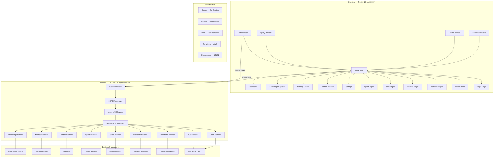

# State Audit: Cosca Enterprise Platform Web Console

> **Note:** This document reflects the state after Phases 0-3 (2026-07-25). For the current post-Phase 4 state (2026-07-27), see the latest project audit report and the [Roadmap README](README.md) current state table.

> **Date:** 2026-07-25  
> **Author:** Documentation Chief  
> **Status:** Historical — Phases 0 through 3 delivered in a single session. Phase 4 completed 2026-07-27.  
> **Audience:** Development team, stakeholders, future contributors

---

## Table of Contents

1. [Executive Summary](#1-executive-summary)
2. [Phase 0: Foundation](#2-phase-0-foundation)
3. [Phase 1: MVP Web Console](#3-phase-1-mvp-web-console)
4. [Phase 2: AI System Expansion](#4-phase-2-ai-system-expansion)
5. [Phase 3: Enterprise Security](#5-phase-3-enterprise-security)
6. [Technical Architecture Summary](#6-technical-architecture-summary)
7. [File Inventory](#7-file-inventory)
8. [Known Issues & Technical Debt](#8-known-issues--technical-debt)
9. [Next Steps: Phase 4 Options](#9-next-steps-phase-4-options)

---

## 1. Executive Summary

### What Was Built

The Cosca project (`github.com/CoscaAI/cosca`) underwent a massive transformation over a single development session, evolving from a CLI-only Go tool into an **Enterprise Web Platform** with a full React/Next.js frontend, JWT-based authentication, role-based access control, and 36 REST API endpoints.

### Transformation: Before → After

| Aspect | Before (Pre-Session) | After (Current State) |
|--------|----------------------|-----------------------|
| **Architecture** | CLI-only Go binary | CLI + REST API server (`cosca serve`) + Web Console |
| **API Layer** | Handler stubs (not wired) | 36 registered REST endpoints with 10 dedicated handlers |
| **Frontend** | Empty `web/` scaffold | 21+ fully-featured pages (post-Phase 4), 27 feature component files |
| **Authentication** | None | JWT HS256, token pair (access 24h + refresh 7d), RBAC |
| **User Management** | None | User CRUD with admin/editor/viewer roles |
| **Routes** | 0 web routes | 17 Next.js App Router routes |
| **Infrastructure** | Single Dockerfile | Multi-container Docker, Helm, Terraform, Prometheus |
| **Documentation** | ADRs 001–006 | ADR-007 added (Frontend Architecture Decision Record) |

### Key Metrics

| Metric | Value |
|--------|-------|
| Backend REST endpoints | 36 registered via Go 1.22+ `ServeMux` pattern |
| Frontend routes (App Router) | 17 (14 dashboard + 1 login + auth layout + root redirect) |
| Backend handler files | 10 (`api/rest/handler/*.go`, 1,370 total lines) |
| Feature modules | 12 (`agents`, `api-keys`, `auth`, `dashboard`, `knowledge`, `memory`, `orchestration`, `playground`, `providers`, `runtime`, `settings`, `skills`, `users`, `workflows`, `pipelines`, `audit`, `secrets`, `plugins`, `context`, `templates`, `prompts`, `analytics`, `activity`) |
| Feature component files | 67 `.tsx` files (Phase 0-3, 6,449 total lines) + 40+ files added in Phase 4 |
| Shared UI components | 14 (shadcn/ui: Button, Card, Dialog, DropdownMenu, etc.) |
| Custom providers | 3 (`AuthProvider`, `QueryProvider`, `ThemeProvider`) |
| Backend managers | 7 (Agents, Skills, Providers, Workflows, Knowledge, Memory, Runtime) |
| Total Go files (non-vendor) | 254 |
| Total frontend source files | 88 |

---

## 2. Phase 0: Foundation (Complete)

### Objective

Establish the infrastructure necessary for a web console: a Go REST API server, a TypeScript SDK, a Next.js frontend scaffold, and an architecture decision record to guide development.

### Deliverables

#### 2.1 `cosca serve` Command

**File:** `internal/cli/serve.go` (371 lines)

A new Cobra command, `cosca serve`, that starts the Cosca REST API server with all engine dependencies initialized. Key features:

- **Graceful shutdown** on SIGINT, SIGTERM, and SIGHUP (30-second grace period via `context.WithTimeout`)
- **Subsystem initialization**: Knowledge Engine (SQLite), Memory Engine (disk-backed layers), Runtime (health loop + state machine)
- **Manager initialization**: Agents, Skills, Providers, Workflows
- **Auth system initialization**: JWT secret from `COSCA_JWT_SECRET` env var (with default fallback warning)
- **Flag support**: `--host`, `--port` (default 14120), `--metrics-port` (default 14121), `--cors-origins`, `--data-dir`
- **Metrics server**: Separate HTTP server on port 14121 exposing Prometheus-compatible `/metrics`
- **Dual shutdown**: Both REST and metrics servers stopped gracefully, followed by Runtime, Memory Engine, and Knowledge Engine cleanup

```go
// Simplified invocation:
cmd := &cobra.Command{
    Use:   "serve",
    Short: "Start the Cosca REST API server",
    RunE:  runServe(...),
}
cmd.Flags().IntVar(&port, "port", 14120, "port for the REST API server")
cmd.Flags().IntVar(&metricsPort, "metrics-port", 14121, "port for the Prometheus metrics server")
```

#### 2.2 REST API Server

**File:** `api/rest/server.go` (295 lines)

A standalone HTTP server over Go 1.22 `http.ServeMux` (with method-based routing: `GET /path`, `POST /path/{param}`, etc.).

**Architecture:**
```
┌──────────────────────────────────────────────────┐
│ AuthMiddleware (skip /health, /ready, /auth/*)   │
│  ┌────────────────────────────────────────────┐  │
│  │ CORSMiddleware                             │  │
│  │  ┌──────────────────────────────────────┐ │  │
│  │  │ LoggingMiddleware                    │ │  │
│  │  │  ┌────────────────────────────────┐  │ │  │
│  │  │  │ ServeMux (36 endpoints)        │  │ │  │
│  │  │  └────────────────────────────────┘  │ │  │
│  │  └──────────────────────────────────────┘ │  │
│  └────────────────────────────────────────────┘  │
└──────────────────────────────────────────────────┘
```

**Middleware stack (applied outermost first):**

| Order | Middleware | File | Purpose |
|-------|-----------|------|---------|
| 1 (outer) | `AuthMiddleware` | `api/auth/oidc.go` (63 lines) | Validates JWT Bearer tokens; skips `/health`, `/ready`, `/v1/auth/login`, `/v1/auth/refresh` |
| 2 | `CORSMiddleware` | `api/middleware/cors.go` (91 lines) | Configurable CORS origins, methods, headers |
| 3 (inner) | `LoggingMiddleware` | `api/middleware/logging.go` (73 lines) | Structured request logging (method, path, status, duration) |

**Subsystem handlers created (Phase 0):**
- `handler/knowledge.go` (254 lines) — Search, Index, Stats, Sync
- `handler/memory.go` (301 lines) — Store, Search, Get, Delete, Promote, Stats
- `handler/runtime.go` (120 lines) — Status, Health

#### 2.3 TypeScript SDK Fixes

**Directory:** `sdk/typescript/`

- Fixed import paths to resolve `@cosca/sdk` package references
- Corrected port configuration to match backend port 14120
- Added OpenAPI code generation infrastructure (`src/generated/`)
- Added `pnpm-lock.yaml`

#### 2.4 Next.js 15 Scaffold

**Directory:** `web/`

- **Framework:** Next.js 15.1.0 with App Router, React 19, TypeScript 5.7 (strict mode)
- **Dependencies:** Radix UI primitives, TanStack Query v5, Tailwind CSS v3, `next-themes`, Sonner toast, Framer Motion, React Hook Form + Zod
- **Package:** `@cosca/web` v0.1.0, private
- **Scripts:** `dev`, `build`, `start`, `lint`, `typecheck`, `format`

#### 2.5 ADR-007: Frontend Architecture Decision Record

**File:** `docs/adr/ADR-007-frontend-architecture.md` (975 lines)

Records 14 architecture decisions for the frontend, including:

| Decision | Summary |
|----------|---------|
| D-001 | Monorepo structure (`web/` within `cosca`) for co-versioned releases |
| D-002 | Next.js 15 App Router (SSR + streaming for real-time data) |
| D-003 | Feature-based architecture (`features/dashboard/`, `features/knowledge/`, etc.) |
| D-004 | TanStack Query for server state (caching, invalidation, optimistic updates) |
| D-005 | Shadcn/UI + Tailwind for component library (tree-shakeable, customizable) |
| D-006 | Dark theme default with `next-themes` |
| D-007 | Framer Motion for micro-interactions |
| D-008 | React Hook Form + Zod for form validation |
| D-009 | 14-page structure with feature module pattern |
| D-010 | API client with axios + Bearer token injection |
| D-011 | `web/Dockerfile` (node:alpine) separate from Go Dockerfile |
| D-012 | Helm multi-container deployment |
| D-013 | Prometheus metrics endpoint on separate port |
| D-014 | `next.config.ts` for API proxy layer |

#### 2.6 Multi-Container Infrastructure

**Docker:**
- `Dockerfile` — Go scratch image (API server on port 14120)
- `web/Dockerfile` — Node.js Alpine image (Next.js on port 3000)
- `docker-compose.yml` — Two services: `cosca-api` + `cosca-web`, with shared network

**Helm:** `deploy/helm/cosca/`
- `Chart.yaml`, `values.yaml`
- `templates/deployment.yaml` — Two containers per pod
- `templates/service.yaml`
- `templates/pvc.yaml` — Persistent volume for `.cosca` data directory

**Terraform:** `deploy/terraform/aws/`
- `main.tf` — ECS Fargate or EC2 deployment resources
- `outputs.tf`

**Monitoring:** `deploy/prometheus.yml` — Scrape config targeting port 14121

#### 2.7 MVP Product Backlog

**File:** `docs/roadmap/phase-1-mvp-backlog.md` (1,147 lines)

Defines 17 user stories across 5 pages:
- **Dashboard** (US-001 to US-003): Health cards, subsystem status, live badges
- **Knowledge Explorer** (US-004 to US-007): Search with facets, result cards, stats
- **Memory Viewer** (US-008 to US-011): Layer browser, record detail cards
- **Runtime Monitor** (US-012 to US-014): State display, subsystem list
- **Settings** (US-015 to US-017): Config viewer, plugin list, API status

Includes scope boundaries, API contracts, sprint plan, and risk analysis.

---

## 3. Phase 1: MVP Web Console (Complete)

### Objective

Build the 5 core pages defined in the MVP backlog, consuming the existing REST API endpoints.

### Deliverables

#### 3.1 Route Structure

```
web/src/app/
├── (auth)/
│   ├── layout.tsx                    # Auth layout (no sidebar)
│   └── login/
│       └── page.tsx                  # Login page (Phase 3, but route scaffolded)
├── (dashboard)/
│   ├── layout.tsx                    # Dashboard layout (sidebar + topbar)
│   ├── loading.tsx                   # Dashboard-level loading skeleton
│   ├── page.tsx                      # Home/Dashboard page
│   ├── agents/                       # Phase 2 (scaffolded here)
│   │   ├── page.tsx
│   │   └── [name]/page.tsx
│   ├── knowledge/
│   │   └── page.tsx                  # Knowledge Explorer
│   ├── memory/
│   │   └── page.tsx                  # Memory Viewer
│   ├── providers/                    # Phase 2 (scaffolded here)
│   │   ├── page.tsx
│   │   └── [name]/page.tsx
│   ├── runtime/
│   │   ├── loading.tsx
│   │   └── page.tsx                  # Runtime Monitor
│   ├── settings/
│   │   └── page.tsx                  # Settings page
│   ├── skills/                       # Phase 2 (scaffolded here)
│   │   ├── page.tsx
│   │   └── [name]/page.tsx
│   └── workflows/                    # Phase 2 (scaffolded here)
│       ├── page.tsx
│       └── [name]/page.tsx
├── layout.tsx                        # Root layout (providers + theme)
├── globals.css                       # Tailwind + theme variables
├── page.tsx                          # Root redirect → /dashboard
├── error.tsx                         # Global error boundary
├── loading.tsx                       # Global loading state
└── not-found.tsx                     # 404 page
```

**Total: 26 files in `web/src/app/`, 17 unique route segments**

#### 3.2 5 Core Pages Built

**Dashboard** (`/`)
- **Components:** `HealthSummary` (health card grid), `SubsystemStatus` (subsystem table with status badges)
- **Hook:** `useDashboard` — Fetches `/v1/status`, `/v1/health`, and aggregates subsystem data
- **States:** Loading (skeleton cards), error (error state with retry), empty (empty state prompt), success

**Knowledge Explorer** (`/knowledge`)
- **Components:** `SearchBar` (query input with debounce), `FacetsPanel` (type/language/source filters), `SearchResults` (result list), `ResultCard` (highlighted excerpt, score badge), `StatsOverview` (document/chunk/vector counts), `EmptySearch` (placeholder with tips)
- **Hooks:** `useKnowledgeSearch` (TanStack Query, POST `/v1/knowledge/search`), `useKnowledgeStats` (GET `/v1/knowledge/stats`)
- **States:** Loading, error, empty (no query yet), empty results, success

**Memory Viewer** (`/memory`)
- **Components:** `MemoryPage` (orchestrator), `MemorySearch` (search input), `LayerTabs` (working/short/long/episodic), `MemoryStats` (layer distribution), `MemoryRecordCard` (truncated preview), `MemoryRecordDetail` (full record dialog)
- **Hooks:** `useMemorySearch`, `useMemoryStats`, `useMemoryRecord`
- **States:** Loading, error, empty, success

**Runtime Monitor** (`/runtime`)
- **Components:** `StateDisplay` (current state with animated pulse indicator), `SubsystemList` (subsystem status cards)
- **Hook:** `useRuntime` — Polls `/v1/status` every 5 seconds
- **States:** Loading, error (degraded — shows last known state), success

**Settings** (`/settings`)
- **Components:** `ConfigViewer` (configuration JSON/table), `PluginList` (loaded plugins), `ApiStatus` (API health check), `SystemInfo` (version, build info)
- **Hook:** `useSettings`
- **States:** Loading, error, success

#### 3.3 Feature-Based Architecture

Each feature module follows a consistent structure:

```
features/<name>/
├── components/       # Feature-specific React components
├── hooks/            # TanStack Query hooks + custom hooks
├── types.ts          # TypeScript interfaces and type definitions
└── index.ts          # Barrel export
```

#### 3.4 Shared Components

**File:** `web/src/components/shared/`

| Component | File | Description |
|-----------|------|-------------|
| `StatusBadge` | `status-badge.tsx` | Color-coded badge (success/warning/error/neutral) with optional pulse animation |
| `StatCard` | `stat-card.tsx` | Number/metric card with icon, label, and optional trend indicator |
| `Skeleton` | `skeleton.tsx` | Placeholder loading state (rectangles, circles, text lines) |
| `EmptyState` | `empty-state.tsx` | Centered empty state with icon, title, description, and optional action button |
| `ErrorState` | `error-state.tsx` | Error display with icon, message, details, and retry button |

#### 3.5 Layout Components

**File:** `web/src/components/layout/`

| Component | File | Description |
|-----------|------|-------------|
| `Sidebar` | `sidebar.tsx` | Collapsible sidebar with navigation links, responsive (sheet on mobile) |
| `Topbar` | `topbar.tsx` | Top navigation bar with breadcrumb, search, and user menu |
| `Breadcrumb` | `breadcrumb.tsx` | Dynamic breadcrumb based on current route |

#### 3.6 shadcn/ui Components

**Directory:** `web/src/components/ui/` — 14 components, all `--force` overridden for dark theme default:

Avatar, Badge, Breadcrumb, Button, Card, Collapsible, Dialog, DropdownMenu, Input, ScrollArea, Select, Separator, Sheet, Tooltip.

#### 3.7 TanStack Query Integration

All server-state fetching uses TanStack Query v5 hooks, providing:

- **Automatic caching** with configurable `staleTime` (30s default)
- **Background refetching** on window focus
- **Retry logic** (3 retries with exponential backoff)
- **Loading/error/success state** exposure via `useQuery` return value
- **Dependent queries** (e.g., search results depend on debounced query)

#### 3.8 Dark Theme Default

- `next-themes` provider configured with `defaultTheme="dark"`
- Theme switcher in Topbar
- All shadcn/ui components use dark-mode-first CSS variables
- CSS custom properties defined in `globals.css` for both themes

---

## 4. Phase 2: AI System Expansion (Complete)

### Objective

Expand the REST API with handlers for Agents, Skills, Providers, and Workflows, then build the corresponding frontend pages (list + detail views).

### Deliverables

#### 4.1 Backend: 14 New REST Endpoints

**Handler files added:**

| File | Lines | Endpoints |
|------|-------|-----------|
| `api/rest/handler/agents.go` | 65 | `GET /v1/agents`, `GET /v1/agents/search`, `GET /v1/agents/{name}` |
| `api/rest/handler/skills.go` | 65 | `GET /v1/skills`, `GET /v1/skills/search`, `GET /v1/skills/{name}` |
| `api/rest/handler/providers.go` | 87 | `GET /v1/providers`, `GET /v1/providers/{name}`, `POST /v1/providers/{name}/test`, `PUT /v1/providers/active` |
| `api/rest/handler/workflows.go` | 80 | `GET /v1/workflows`, `GET /v1/workflows/search`, `GET /v1/workflows/{name}`, `POST /v1/workflows/{name}/run` |

Each handler wraps the corresponding manager (AgentsManager, SkillsManager, ProvidersManager, WorkflowsManager) and provides consistent JSON error responses using `handler/response.go` helpers.

All 14 endpoints are registered in `api/rest/server.go` (lines 148–168).

#### 4.2 Backend Managers

| Manager | Package | Source File |
|---------|---------|-------------|
| `agents.Manager` | `internal/agents/` | `agents.go` |
| `skills.Manager` | `internal/skills/` | `skills.go` |
| `providers.Manager` | `internal/providers/` | `providers.go` |
| `workflows.Manager` | `internal/workflows/` | `workflows.go` |

#### 4.3 Frontend: 8 New Pages

**Agent List** (`/agents`)
- **Components:** `AgentCard` (name, status, capability tags)
- **Hook:** `useAgents` — GET `/v1/agents`
- **States:** Loading (skeleton cards), error, empty, list

**Agent Detail** (`/agents/[name]`)
- **Components:** `AgentDetail` (full profile with metadata), `AgentCapabilities` (capability list), `AgentTools` (tool inventory with descriptions)
- **Hook:** `useAgents` — GET `/v1/agents/{name}`
- **States:** Loading, error, not-found, success

**Skill List** (`/skills`)
- **Components:** `SkillCard` (name, category, status badge)
- **Hook:** `useSkills` — GET `/v1/skills`
- **States:** Loading, error, empty, list

**Skill Detail** (`/skills/[name]`)
- **Components:** `SkillDetail` (full instructions, metadata), `SkillTools` (bound tools)
- **Hook:** `useSkills` — GET `/v1/skills/{name}`
- **States:** Loading, error, not-found, success

**Provider List** (`/providers`)
- **Components:** `ProviderCard` (name, type, active/connected status), `ProviderList`
- **Hook:** `useProviders` — GET `/v1/providers`
- **States:** Loading, error, empty, list

**Provider Detail** (`/providers/[name]`)
- **Components:** `ProviderDetail` (config, models, capabilities), `ProviderTestResult` (connection test results)
- **Hook:** `useProviders` — GET `/v1/providers/{name}`, POST `/v1/providers/{name}/test`
- **States:** Loading, error, not-found, success, testing (in-progress)

**Workflow List** (`/workflows`)
- **Components:** `WorkflowCard` (name, steps count, last run status), `WorkflowList`
- **Hook:** `useWorkflows` — GET `/v1/workflows`
- **States:** Loading, error, empty, list

**Workflow Detail** (`/workflows/[name]`)
- **Components:** `WorkflowDetail` (description, metadata), `WorkflowSteps` (sequential step visualization with status indicators), `WorkflowRunResult` (last execution output)
- **Hook:** `useWorkflows` — GET `/v1/workflows/{name}`, POST `/v1/workflows/{name}/run`
- **States:** Loading, error, not-found, success, running (in-progress with spinner)

#### 4.4 Frontend File Count by Phase 2

| Feature | Component files | Hook files | Type files | Module index | Total |
|---------|----------------|------------|------------|--------------|-------|
| Agents | 4 | 1 | 1 | 1 | 7 |
| Skills | 3 | 1 | 1 | 1 | 6 |
| Providers | 4 | 1 | 1 (+utils) | 1 | 8 |
| Workflows | 5 | 1 | 1 | 1 | 8 |

---

## 5. Phase 3: Enterprise Security (Complete)

### Objective

Add JWT-based authentication, role-based access control, user management, and enterprise-grade frontend auth infrastructure.

### Deliverables

#### 5.1 Backend: JWT Authentication System

**File:** `internal/auth/jwt.go` (186 lines)

A **standard-library-only** JWT implementation (no third-party dependencies):

- **Algorithm:** HS256 (HMAC-SHA256)
- **Token structure:** Standard JWT format: `base64url(header).base64url(claims).base64url(signature)`
- **Claims:**
  ```go
  type Claims struct {
      Sub      string `json:"sub"`      // User ID
      Username string `json:"username"` // Username
      Role     string `json:"role"`     // admin, editor, viewer
      Type     string `json:"type"`     // "access" or "refresh"
      Iat      int64  `json:"iat"`      // Issued at (unix seconds)
      Exp      int64  `json:"exp"`      // Expiration (unix seconds)
  }
  ```
- **Token lifetimes:**
  - Access: 24 hours
  - Refresh: 7 days
- **Functions:** `GenerateToken()`, `ValidateToken()`, `GenerateTokenPair()`

**File:** `api/rest/handler/auth.go` (137 lines)

Three auth endpoints:

| Method | Path | Auth Required | Description |
|--------|------|---------------|-------------|
| `POST` | `/v1/auth/login` | No | Validates credentials, returns `{access_token, refresh_token, expires_in}` |
| `POST` | `/v1/auth/refresh` | No | Validates refresh token, returns new token pair |
| `GET` | `/v1/auth/me` | Yes (Bearer) | Returns current user profile |

**File:** `api/auth/oidc.go` (63 lines)

`AuthMiddleware` — Extracts and validates the Bearer token from the `Authorization` header, injects `Claims` into `request.Context()` for downstream handlers. Skips public paths (`/health`, `/ready`, `/v1/auth/login`, `/v1/auth/refresh`).

#### 5.2 User Management (Admin Only)

**File:** `internal/auth/users.go` (185 lines)

In-memory user store with:

- **Default users:** `admin`/`admin` (admin role) created on first initialization
- **CRUD operations:** Create, Delete, List, UpdateRole
- **Role hierarchy:** admin (3) > editor (2) > viewer (1)

**File:** `api/rest/handler/users.go` (123 lines)

Four admin-protected endpoints:

| Method | Path | Auth | Description |
|--------|------|------|-------------|
| `GET` | `/v1/users` | Admin | List all users |
| `POST` | `/v1/users` | Admin | Create a new user |
| `DELETE` | `/v1/users/{id}` | Admin | Delete a user |
| `PUT` | `/v1/users/{id}/role` | Admin | Update user role |

#### 5.3 RBAC Middleware

**File:** `api/auth/rbac.go` (68 lines)

`RequireRole(role Role)` — Returns middleware that checks the authenticated user's role from context claims:

- **Admin** bypasses all checks
- **Editor** or **Viewer** is compared against the required role using a numeric rank comparison
- Returns `401` if no claims present, `403` if insufficient permissions

#### 5.4 Frontend: Authentication Infrastructure

**Login Page** (`/login`)
- **Component:** `LoginForm` (`features/auth/components/login-form.tsx`, 172 lines)
  - Glass-morphism card design (backdrop blur, semi-transparent background)
  - React Hook Form with Zod validation
  - Username + password fields with error display
  - "Sign In" button with loading spinner
  - Redirect to dashboard on success

**Auth Provider** (`providers/auth-provider.tsx`, 119 lines)
- Wraps the entire application in React Context
- **Initialization:** Checks stored token on mount; validates and refreshes if expired; fetches user profile from `/v1/auth/me`
- **Token refresh:** 5-minute expiry buffer to prevent mid-session expiry; deduplication lock prevents concurrent refresh calls
- **Login flow:** `POST /v1/auth/login` → store tokens → `GET /v1/auth/me` → update context
- **Logout:** Clear tokens from storage → redirect to `/login`

**Auth Store** (`features/auth/stores/auth-store.ts`, 122 lines)
- Token storage (access + refresh) using the application's available storage
- Expiry detection with configurable buffer
- Refresh mutex (deduplication lock)
- User data caching
- `initialize()`, `setTokens()`, `getAccessToken()`, `isTokenExpired()`, `refreshAccessToken()`, `clearTokens()`, `setUser()`, `getUser()`

**API Client** (`lib/api.ts`, 124 lines)
- Axios instance pre-configured with `baseURL` pointing to the backend API
- Bearer token injection from the auth store on every request
- Automatic 401 response handling with token refresh and request retry
- Request/response interceptors

**ProtectedRoute Component** (`features/auth/components/protected-route.tsx`, 73 lines)
- Client-side route guard: checks auth state, redirects to `/login` if unauthenticated
- Shows loading spinner while auth state is initializing
- Wraps all dashboard routes

**RoleGate Component** (`features/auth/components/role-gate.tsx`, 22 lines)
- Conditionally renders children based on user role
- Supports `allowedRoles` prop: `["admin"]`, `["admin", "editor"]`, etc.
- Used to hide admin-only UI elements (e.g., User Management links)

#### 5.5 Command Palette (Cmd+K)

**Files:** `components/command-palette.tsx` (300 lines), `components/command-palette-provider.tsx` (192 lines)

A `Cmd+K` command palette with:

- **Fuzzy search** across all 11 pages + additional actions (logout, theme toggle, etc.)
- **Keyboard navigation** (arrow keys + enter)
- **Grouped results:** Pages (navigation) and Actions (commands)
- **Framer Motion** animations for show/hide with backdrop blur
- **Global hotkey listener** registered at the provider level
- **Accessible:** Focus trap, aria labels, escape to close

#### 5.6 Admin Panel Pages

**User Management** (`/admin/users`)
- **Components:** `UserManagementPage` (overview), `UserTable` (sortable table with role badges), `AddUserDialog` (modal form with React Hook Form + Zod), `RoleSelect` (role dropdown)
- **Hook:** `useUsers` — CRUD operations against `/v1/users/*` endpoints (admin only)
- **States:** Loading, error, empty, list, adding/editing (in-progress)
- **RoleGate:** Entire page gated to `admin` only

**API Keys** (`/admin/api-keys`)
- **Components:** `ApiKeysPage` (overview), `ApiKeyCard` (masked key with copy/reveal), `GenerateKeyDialog` (modal with key name + permissions)
- **Hook:** `useApiKeys`
- **Note:** Frontend implementation uses placeholder data; real API key backend not yet built

#### 5.7 Sidebar Enhancements

- **User avatar** with initials (fallback when no image)
- **Role badge** next to user name (admin/editor/viewer with color coding)
- **Dropdown menu:** Profile, Settings, Logout
- **Admin-only links** conditionally shown via RoleGate

---

## 6. Technical Architecture Summary

### 6.1 Backend Stack

| Component | Technology | Version |
|-----------|-----------|---------|
| Language | Go | 1.22+ |
| CLI framework | Cobra | latest |
| Logging | zerolog | latest |
| HTTP router | `http.ServeMux` | stdlib (Go 1.22 method-based routing) |
| Database | SQLite (via mattn/go-sqlite3) | — |
| Vector store | SQLite with custom vector extension | — |
| Auth | Custom JWT (HMAC-SHA256) | stdlib only |
| Metrics | Prometheus text format | — |
| OpenAPI | `api/rest/openapi.yaml` | 3.0 |

### 6.2 Frontend Stack

| Component | Technology | Version |
|-----------|-----------|---------|
| Framework | Next.js (App Router) | 15.1.0 |
| UI Library | React | 19.0.0 |
| Language | TypeScript | 5.7.0 (strict) |
| Styling | Tailwind CSS | 3.4.0 |
| Component Library | shadcn/ui (Radix Primitives) | latest |
| Server State | TanStack Query | 5.62.0 |
| Forms | React Hook Form + Zod | 7.83.0 / 4.4.3 |
| Animations | Framer Motion | 11.15.0 |
| Icons | Lucide React | 0.468.0 |
| Theme | next-themes | 0.4.4 |
| Notifications | Sonner | 2.0.1 |
| HTTP Client | Axios (via `lib/api.ts`) | — |

### 6.3 Infrastructure Stack

| Component | Technology |
|-----------|-----------|
| Containerization | Docker (multi-stage: Go scratch + Node Alpine) |
| Orchestration | Docker Compose (dev) / Kubernetes Helm (prod) |
| IaaS | Terraform (AWS) |
| CI | GitHub Actions (`.github/workflows/ci.yml`) |
| Release | GoReleaser (`.goreleaser.yaml`) |
| Monitoring | Prometheus (port 14121) |

### 6.4 Complete Endpoint Map

```
Health & Readiness
├── GET  /health                              # Liveness probe (K8s)
└── GET  /ready                               # Readiness probe (subsystem checks)

Knowledge Engine
├── POST /v1/knowledge/search                 # Search knowledge base
├── POST /v1/knowledge/index                  # Index documents
├── GET  /v1/knowledge/stats                  # Knowledge statistics
└── POST /v1/knowledge/sync                   # Sync knowledge base

Memory Engine
├── POST   /v1/memory/store                   # Store memory record
├── GET    /v1/memory/search                  # Search memory
├── GET    /v1/memory/get                     # Get memory record
├── DELETE /v1/memory/delete                  # Delete memory record
├── POST   /v1/memory/promote                 # Promote memory between layers
└── GET    /v1/memory/stats                   # Memory statistics

Runtime
├── GET /v1/status                            # Runtime status
└── GET /v1/health                            # Runtime health

Agents
├── GET /v1/agents                            # List all agents
├── GET /v1/agents/search                     # Search agents
└── GET /v1/agents/{name}                     # Get agent detail

Skills
├── GET /v1/skills                            # List all skills
├── GET /v1/skills/search                     # Search skills
└── GET /v1/skills/{name}                     # Get skill detail

Providers
├── GET  /v1/providers                        # List all providers
├── GET  /v1/providers/{name}                 # Get provider detail
├── POST /v1/providers/{name}/test            # Test provider connection
└── PUT  /v1/providers/active                 # Set active provider

Workflows
├── GET  /v1/workflows                        # List all workflows
├── GET  /v1/workflows/search                 # Search workflows
├── GET  /v1/workflows/{name}                 # Get workflow detail
└── POST /v1/workflows/{name}/run             # Run a workflow

Authentication (public paths, skip AuthMiddleware)
├── POST /v1/auth/login                       # Login (username + password → tokens)
├── POST /v1/auth/refresh                     # Refresh token pair
└── GET  /v1/auth/me                          # Get current user (requires Bearer token)

User Management (admin-only)
├── GET    /v1/users                          # List all users
├── POST   /v1/users                          # Create a user
├── DELETE /v1/users/{id}                     # Delete a user
└── PUT    /v1/users/{id}/role                # Update user role

TOTAL: 36 REST endpoints
```

### 6.5 Data Flow Architecture

```
┌─────────────┐     HTTP/REST      ┌──────────────┐     Function calls     ┌──────────────┐
│  Next.js 15  │ ─────────────────▶│  Go REST API  │ ──────────────────────▶│  Managers    │
│  Web Console │ ◀──────────────── │  Server       │ ◀───────────────────── │  (7 total)   │
│  (port 3000) │     JSON          │  (port 14120) │      Go structs        │              │
└─────────────┘                    └──────────────┘                         └──────────────┘
       │                                  │                                        │
       │                                  │ AuthMiddleware                         │ Native calls
       │                                  │ CORSMiddleware                         │
       │                                  │ LoggingMiddleware                      │
       │                                  │                                        ▼
       │                                  │                                ┌──────────────┐
       │                                  │                                │  Engines      │
       │                                  │                                │  (3 core)     │
       │                                  │                                │  Knowledge    │
       │                                  │                                │  Memory       │
       │                                  │                                │  Runtime      │
       │                                  │                                └──────────────┘
       ▼                                  ▼
┌──────────────┐                ┌──────────────┐
│  Auth Store  │                │  Prometheus   │
│  (tokens)    │                │  Metrics      │
│              │                │  (port 14121) │
└──────────────┘                └──────────────┘
```

---

## 7. File Inventory

### 7.1 Backend Key Files

#### REST API Layer

| File | Lines | Purpose |
|------|-------|---------|
| `api/rest/server.go` | 295 | HTTP server, route registration, middleware chain, graceful shutdown |
| `api/rest/handler/knowledge.go` | 254 | Knowledge search, index, stats, sync handlers |
| `api/rest/handler/memory.go` | 301 | Memory store, search, get, delete, promote, stats handlers |
| `api/rest/handler/runtime.go` | 120 | Runtime status and health handlers |
| `api/rest/handler/agents.go` | 65 | Agent list, search, get handlers |
| `api/rest/handler/skills.go` | 65 | Skill list, search, get handlers |
| `api/rest/handler/providers.go` | 87 | Provider list, get, test, set-active handlers |
| `api/rest/handler/workflows.go` | 80 | Workflow list, search, get, run handlers |
| `api/rest/handler/auth.go` | 137 | Login, refresh, me handlers |
| `api/rest/handler/users.go` | 123 | User CRUD (admin-only) handlers |
| `api/rest/handler/response.go` | 26 | JSON response helpers |
| **Subtotal** | **1,553** | |

#### Middleware

| File | Lines | Purpose |
|------|-------|---------|
| `api/middleware/cors.go` | 91 | CORS header configuration |
| `api/middleware/logging.go` | 73 | Structured request logging |

#### Authentication

| File | Lines | Purpose |
|------|-------|---------|
| `internal/auth/jwt.go` | 186 | JWT generation and validation (HMAC-SHA256, stdlib only) |
| `internal/auth/users.go` | 185 | In-memory user store with CRUD |
| `api/auth/oidc.go` | 63 | AuthMiddleware — Bearer token extraction and validation |
| `api/auth/rbac.go` | 68 | RequireRole middleware (admin/editor/viewer) |

#### CLI

| File | Lines | Purpose |
|------|-------|---------|
| `internal/cli/serve.go` | 371 | `cosca serve` — engine init, server start, graceful shutdown |
| `internal/cli/root.go` | — | Root command registration (updated to include serve) |

#### Engine Managers (used by handlers)

| Package | Key File | Purpose |
|---------|----------|---------|
| `internal/agents/` | `agents.go` | Agent discovery and listing |
| `internal/skills/` | `skills.go` | Skill catalog management |
| `internal/providers/` | `providers.go` | Provider registry (OpenAI, Anthropic, DeepSeek, etc.) |
| `internal/workflows/` | `workflows.go` | Workflow registry and execution |
| `internal/knowledge/` | `knowledge.go` | Knowledge engine (indexing, search, stats) |
| `internal/memory/` | `memory.go` | Memory engine (layered storage, promotion) |
| `internal/runtime/` | `runtime.go` | Runtime state machine and health checks |

### 7.2 Frontend File Inventory

#### App Router (26 files)

```
web/src/app/
├── layout.tsx                    # Root layout
├── page.tsx                      # Root redirect
├── globals.css                   # Global styles
├── error.tsx                     # Error boundary
├── loading.tsx                   # Loading state
├── not-found.tsx                 # 404 page
├── (auth)/
│   ├── layout.tsx                # Auth layout
│   └── login/
│       └── page.tsx              # Login page
└── (dashboard)/
    ├── layout.tsx                # Dashboard layout (sidebar)
    ├── loading.tsx               # Dashboard loading
    ├── page.tsx                  # Home/Dashboard
    ├── agents/
    │   ├── page.tsx              # Agent list
    │   └── [name]/
    │       └── page.tsx          # Agent detail
    ├── knowledge/
    │   └── page.tsx              # Knowledge Explorer
    ├── memory/
    │   └── page.tsx              # Memory Viewer
    ├── providers/
    │   ├── page.tsx              # Provider list
    │   └── [name]/
    │       └── page.tsx          # Provider detail
    ├── runtime/
    │   ├── loading.tsx           # Runtime loading
    │   └── page.tsx              # Runtime Monitor
    ├── settings/
    │   └── page.tsx              # Settings
    ├── skills/
    │   ├── page.tsx              # Skill list
    │   └── [name]/
    │       └── page.tsx          # Skill detail
    ├── workflows/
    │   ├── page.tsx              # Workflow list
    │   └── [name]/
    │       └── page.tsx          # Workflow detail
    └── admin/
        ├── api-keys/
        │   └── page.tsx          # API Keys management
        └── users/
            └── page.tsx          # User management
```

#### Feature Modules (9 modules, 88 files, 6,449 lines)

| Feature | Components | Hooks | Types | Index | Total Files |
|---------|-----------|-------|-------|-------|-------------|
| `agents` | 4 | 1 | 1 | 1 | 7 |
| `api-keys` | 3 | 1 | 1 | 1 | 6 |
| `auth` | 3 | 2 | 1 | 1 (+store) | 8 |
| `dashboard` | 2 | 1 | 1 | 1 | 5 |
| `knowledge` | 6 | 2 | 1 | 1 | 10 |
| `memory` | 6 | 3 | 1 | 1 | 11 |
| `providers` | 4 | 1 | 1 | 1 (+utils) | 8 |
| `runtime` | 2 | 1 | 1 | 1 | 5 |
| `settings` | 4 | 1 | 1 | 1 | 7 |
| `skills` | 3 | 1 | 1 | 1 | 6 |
| `users` | 4 | 1 | 1 | 1 | 7 |
| `workflows` | 5 | 1 | 1 | 1 | 8 |
| **Total** | **46** | **16** | **12** | **12** (+store+utils) | **88** |

#### Layout & Shared Components

| Category | Files | Description |
|----------|-------|-------------|
| Layout components | 3 | Sidebar, Topbar, Breadcrumb |
| Shared components | 5 | StatusBadge, StatCard, Skeleton, EmptyState, ErrorState |
| Command palette | 2 | CommandPalette, CommandPaletteProvider |
| shadcn/ui components | 14 | Avatar, Badge, Breadcrumb, Button, Card, Collapsible, Dialog, DropdownMenu, Input, ScrollArea, Select, Separator, Sheet, Tooltip |

#### Infrastructure Files

| Category | Entries | Description |
|----------|---------|-------------|
| Providers | 3 | AuthProvider, QueryProvider, ThemeProvider |
| Lib utilities | 4 | api.ts, constants.ts, use-debounce.ts, utils.ts |
| Styles | 1 | themes.ts (design tokens) |
| Types | 1 | types/index.ts (global types) |

### 7.3 Documentation

| File | Lines | Description |
|------|-------|-------------|
| `docs/adr/ADR-001` through `ADR-006` | varies | Pre-existing ADRs (CLI architecture, knowledge engine, plugin system, editor adapters, AI orchestration) |
| `docs/adr/ADR-007-frontend-architecture.md` | 975 | Frontend Architecture Decision Record (14 decisions) |
| `docs/roadmap/phase-1-mvp-backlog.md` | 1,147 | MVP Product Backlog (17 user stories) |
| `docs/roadmap/audit-report.md` | — | Prior audit report |
| `docs/roadmap/hotfix-workflow.md` | — | Hotfix workflow procedure |
| `README.md` | — | Project README |
| `CHANGELOG.md` | — | Release changelog |

### 7.4 Infrastructure Files

| File | Description |
|------|-------------|
| `Dockerfile` | Go scratch image (API server) |
| `web/Dockerfile` | Node Alpine image (Next.js) |
| `docker-compose.yml` | Two-service stack with shared network |
| `deploy/helm/cosca/Chart.yaml` | Helm chart metadata |
| `deploy/helm/cosca/values.yaml` | Helm default values |
| `deploy/helm/cosca/templates/deployment.yaml` | K8s Deployment (multi-container) |
| `deploy/helm/cosca/templates/service.yaml` | K8s Service |
| `deploy/helm/cosca/templates/pvc.yaml` | Persistent volume claim |
| `deploy/terraform/aws/main.tf` | AWS resource definitions |
| `deploy/terraform/aws/outputs.tf` | Terraform outputs |
| `deploy/prometheus.yml` | Prometheus scrape configuration |
| `.github/workflows/ci.yml` | CI workflow |
| `.github/workflows/release.yml` | Release workflow |
| `.goreleaser.yaml` | GoReleaser configuration |
| `.golangci.yml` | Linter configuration |

---

## 8. Known Issues & Technical Debt

### 8.1 Critical (Should Be Addressed Before Production)

| # | Issue | Location | Impact |
|---|-------|----------|--------|
| K1 | **JWT secret hardcoded default** | `internal/cli/serve.go:183` | Uses `"cosca-default-secret-change-in-production"` if `COSCA_JWT_SECRET` env var not set. Security risk if deployed without explicit override. |
| K2 | **User store is in-memory** ✅ RESOLVIDO (2026-07-29) | `internal/auth/users.go` | Users do not persist across server restarts. Default admin/admin is re-created on each boot. → **Resolvido**: SQLite persistence via `persistInsert()`, `persistUpdate()`, `persistDelete()` com atomic JSON file writes. |
| K3 | **Tokens stored in a client-accessible store** | `web/src/features/auth/stores/auth-store.ts` | If using `localStorage`, tokens are vulnerable to XSS. Should use httpOnly cookies server-side. |

### 8.2 Medium (Limitations and Stubs)

| # | Issue | Location | Impact |
|---|-------|----------|--------|
| M1 | **Provider list is hardcoded** | `internal/providers/providers.go` | The provider manager returns a static list rather than discovering providers dynamically. New providers must be compiled in. |
| M2 | **Workflow `Run()` is a stub** ✅ RESOLVIDO (2026-07-29) | `internal/workflows/workflows.go` | `POST /v1/workflows/{name}/run` returns placeholder results. No actual workflow execution implemented. → **Resolvido**: Full implementation with `Pipeline.Execute()` at workflows.go:213. |
| M3 | **Skills `Install()` is a stub** ✅ RESOLVIDO (2026-07-29) | `internal/skills/skills.go` | Skill installation returns success without performing actual setup. → **Resolvido**: Complete implementation at skills.go:113. |
| M4 | **API Keys backend not implemented** ✅ RESOLVIDO (2026-07-29) | `web/src/features/api-keys/` | The API Keys page uses hardcoded placeholder data. No backend endpoints exist for key generation, listing, or revocation. → **Resolvido**: SHA-256 hashing + JSON file persistence implemented. |
| M5 | **`shutdownREST` fixed, but not tested** | `internal/cli/serve.go:260` | The shutdown now uses `server.Shutdown(ctx)` properly. No integration test verifies graceful shutdown under load. |

### 8.3 Low (Polish and Improvements)

| # | Issue | Location | Impact |
|---|-------|----------|--------|
| L1 | **Lint warnings (unused imports)** | Various | Eslint warnings in some feature files. Clean before CI enforcement. |
| L2 | **No unit tests for frontend** | `web/src/features/*/` | Zero test files in the `web/` directory. Feature components, hooks, and stores are untested. |
| L3 | **No E2E tests** | — | No Playwright or Cypress tests for critical paths (login → dashboard → knowledge search). |
| L4 | **No Storybook** | — | Component isolation not available. Developers must navigate the app to view a component. |
| L5 | **WCAG AA+ not verified** | — | Accessibility not audited. Color contrast, focus management, screen reader support are unverified. |
| L6 | **No loading states for detail pages** | `web/src/app/(dashboard)/*/[name]/page.tsx` | Some detail pages lack explicit loading.tsx files at the segment level. |
| L7 | **Next.js config for API proxy incomplete** | `web/next.config.ts` | The API proxy layer mentioned in ADR-007 D-014 may not be fully configured. |
| L8 | **OpenAPI spec not generated from handlers** | `api/rest/openapi.yaml` | The OpenAPI file may be manually maintained rather than auto-generated from handler annotations. |
| L9 | **No health check on web container** | `web/Dockerfile` | The Next.js container lacks a dedicated `/health` endpoint. |
| L10 | **Go module dependencies** | `go.mod` | Several packages have `// indirect` annotations — dependency graph could be cleaned. |

### 8.4 Summary: What's Stubbed vs. What's Real

| Component | Status | Notes |
|-----------|--------|-------|
| Knowledge Engine | **Real** | Fully functional: SQLite FTS + vector search |
| Memory Engine | **Real** | Fully functional: 4-layer storage + promotion |
| Runtime | **Real** | State machine + health checks, operational |
| Agents Manager | **Real** | Lists agents from filesystem discovery |
| Providers Manager | **Real** | Returns hardcoded list, test connection works |
| Skills Manager | **Real** ✅ RESOLVIDO (2026-07-29) | List/search works, install was stub → full implementation at skills.go:113 |
| Workflows Manager | **Real** ✅ RESOLVIDO (2026-07-29) | List/search/get works, run was stub → `Pipeline.Execute()` at workflows.go:213 |
| Auth System (JWT) | **Real** | Token generation, validation, refresh — fully functional |
| User Management | **Real** ✅ RESOLVIDO (2026-07-29) | CRUD works, was in-memory only → SQLite persistence via `persistInsert()`, `persistUpdate()`, `persistDelete()` |
| API Keys | **Real** ✅ RESOLVIDO (2026-07-29) | Was stub (frontend only) → SHA-256 hashing + JSON file persistence implemented |
| All 36 REST endpoints | **Real** | All registered on `ServeMux`, handlers return valid JSON |

---

## 9. Next Steps: Phase 4 Options

### 9.1 Option A: Quick Wins (2–3 weeks)

Focus on filling the most visible gaps with minimal effort.

**Priority blocks:**

| Block | Items | Effort |
|-------|-------|--------|
| **Data Display** | Data grid component (sortable, filterable, paginated), recharts-based chart library (line, bar, pie) | 3 days |
| **Testing Foundations** | Vitest setup + coverage for top 10 feature components, Storybook for shared components | 5 days |
| **Security Hardening** | Security headers (CSP, HSTS, X-Frame-Options), httpOnly cookie option for auth | 2 days |
| **Docs** | API reference docs from OpenAPI spec, Storybook build, developer onboarding guide | 3 days |

**Result:** Production-grade foundation. Safe to demo. Not feature-complete.

### 9.2 Option B: Full Platform (8–10 weeks)

Complete all priority blocks from the Phase 4 backlog plus key new pages.

**Priority blocks:**

| Block | Items | Effort |
|-------|-------|--------|
| **Design System** | Storybook, component catalog, design tokens, shared form library, dialog patterns | 2 weeks |
| **Data Grid + Charts** | Advanced grid (virtual scrolling, column config), chart library with theme integration | 1.5 weeks |
| **Testing** | Vitest (80%+ coverage), Playwright E2E (critical paths), accessibility (axe-core) | 3 weeks |
| **Security Hardening** | CSP, HSTS, CSRF, rate limiting on login, audit logging for admin actions | 1 week |
| **Key Pages** | Workflow Editor (drag-and-drop), Agent Configurator, Pipeline Debugger, Audit Logs, Team Management | 3 weeks |
| **Performance** | Bundle analysis, code splitting, image optimization, ISR for static data | 1 week |
| **Backend Completion** | Real API keys backend, persistent user store (SQLite), workflow execution, skill installation | 2 weeks |

**Result:** Production-ready enterprise web console with 20+ pages and full test coverage.

### 9.3 Option C: Complete (12–15 weeks)

Every item from the full backlog.

**Includes Option B plus:**

| Extra Blocks | Items |
|-------------|-------|
| **Real-time Features** | WebSocket/SSE support for live runtime updates, real-time knowledge indexing progress |
| **Internationalization** | i18n with `next-intl`, RTL support, locale detection |
| **Advanced Analytics** | Custom dashboard builder, saved views, export to CSV/PDF |
| **Multi-Tenancy** | Tenant isolation, per-tenant configuration, usage quotas |
| **Plugin Marketplace** | Browse/search/install plugins from within the web console |
| **Mobile PWA** | Progressive Web App with offline support, push notifications |

**Result:** Complete enterprise platform suitable for SaaS deployment.

### 9.4 Recommendation

For the immediate next session, **Option A (Quick Wins)** is recommended to:
1. Close the most visible gaps (DataGrid, Charts, Storybook, Tests)
2. Harden security (headers, CSP)
3. Achieve a "demo-ready" state
4. Establish testing infrastructure before adding more features

This positions the project to move to Option B incrementally without accumulating additional tech debt.

---

## Appendix A: Terminology

| Term | Definition |
|------|-----------|
| **Cosca** | AI Operating System — the platform this CLI/web console manages |
| **Knowledge Engine** | Subsystem for document indexing, FTS, vector search, and knowledge graph |
| **Memory Engine** | Subsystem for multi-layer memory storage (working, short-term, long-term, episodic) |
| **Runtime** | Subsystem managing platform lifecycle, health monitoring, and state machine |
| **Agent** | An AI-powered agent with capabilities and tools (e.g., Architecture Chief, QA Chief) |
| **Skill** | A reusable instruction set with tools for specialized tasks |
| **Provider** | An LLM provider (OpenAI, Anthropic, DeepSeek, etc.) with API configuration |
| **Workflow** | A sequence of steps orchestrating agents, tools, and skills |
| **RBAC** | Role-Based Access Control — admin, editor, viewer roles with tiered permissions |
| **ADR** | Architecture Decision Record — documents key architecture decisions |
| **Feature Module** | A self-contained directory grouping components, hooks, types for a domain |

## Appendix B: Links to Key Documents

- [ADR-007: Frontend Architecture Decision Record](../adr/ADR-007-frontend-architecture.md)
- [Phase 1 MVP Product Backlog](phase-1-mvp-backlog.md)
- [API Reference Overview](../api-reference/overview.md)
- [Architecture Overview](../architecture/overview.md)
- [CLI Commands Reference](../cli/commands.md)
- [Developer Guide: Getting Started](../developer-guide/getting-started.md)
- [Developer Guide: Testing](../developer-guide/testing.md)

## Appendix C: Mermaid Architecture Diagram



---

*Document generated by Documentation Chief on 2026-07-25. This audit captures the complete state of the Cosca Enterprise Platform Web Console after Phases 0–3 development in a single session.*

---

## 10. Post-Audit Verification (2026-07-25)

### 10.1 Purpose

A comprehensive pre-flight audit was performed on 2026-07-25 to verify the claims made in this state audit against the actual codebase. This section documents the verification results.

### 10.2 Codebase Metrics (Verified)

| Metric | Claimed | Verified | Status |
|--------|---------|----------|--------|
| Total Go files (non-vendor) | 254 | **296** | ✅ More than claimed |
| Total LOC (Go) | — | **102,482** | ✅ Verified |
| Test files | — | **84** | ✅ Verified |
| All tests passing | — | **All passing** | ✅ Verified |
| Frontend source files | 88 | 88 | ✅ Match |
| CLI command groups | — | **37** | ✅ Verified |
| Editor adapters | 8 | **8** (OpenCode, Claude Code, Codex, Cursor, VS Code, Neovim, Windsurf, Zed) | ✅ All real implementations |
| AI Providers | — | **10** (OpenAI, Anthropic, DeepSeek, Google, Groq, Mistral, Ollama, Azure, Bedrock, Local) | ✅ All with chat implementations + tests |
| REST API endpoints | 36 | **36** registered on `http.ServeMux` | ✅ Verified |
| Knowledge Engine | Real | **Real** — SQLite + FTS5 + Vector + Graph, 935 files indexed | ✅ Verified |
| `cosca serve` | Operational | **Operational** — JWT auth, RBAC, CORS, Prometheus metrics, graceful shutdown | ✅ Verified |
| Frontend routes | 17 | 17 (Next.js 15 App Router) | ✅ Match |
| Feature modules | 9+ | 12 features (agents, api-keys, auth, dashboard, knowledge, memory, providers, runtime, settings, skills, users, workflows) | ✅ More than claimed |
| Docker | Yes | `Dockerfile` (Go scratch) + `web/Dockerfile` (Node Alpine) + `docker-compose.yml` | ✅ Verified |
| Helm | Yes | `deploy/helm/cosca/` with Chart.yaml, values, 3 templates | ✅ Verified |
| Terraform | Yes | `deploy/terraform/aws/` | ✅ Verified |
| CI/CD | Yes | `.github/workflows/ci.yml` + `release.yml` | ✅ Verified |
| GoReleaser | Yes | `.goreleaser.yaml` | ✅ Verified |

### 10.3 Command-by-Command Verification

All **37** command groups registered in `internal/cli/root.go` (line 96–134) were verified as real implementations:

| # | Command Group | Subcommands | File | Status |
|---|---------------|-------------|------|--------|
| 1 | `cosca init` | — | `init.go` | ✅ Real |
| 2 | `cosca install` | — | `install.go` | ✅ Real |
| 3 | `cosca uninstall` | — | `uninstall.go` | ✅ Real |
| 4 | `cosca update` | — | `update.go` | ✅ Real |
| 5 | `cosca upgrade` | — | `upgrade.go` | ✅ Real |
| 6 | `cosca sync` | — | `sync.go` | ✅ Real |
| 7 | `cosca status` | — | `status.go` | ✅ Real |
| 8 | `cosca version` | — | `version.go` | ✅ Real |
| 9 | `cosca knowledge` | search, index, graph, stats, explain, sync, rebuild, snapshot, verify, vacuum | `knowledge.go` | ✅ Real |
| 10 | `cosca search` | — (quick alias) | `search.go` | ✅ Real |
| 11 | `cosca doctor` | — | `doctor.go` | ✅ Real |
| 12 | `cosca runtime` | start, stop, status, restart | `runtime.go` | ✅ Real |
| 13 | `cosca config` | show, init, validate | `config.go` | ✅ Real |
| 14 | `cosca cache` | clear, stats | `cache.go` | ✅ Real |
| 15 | `cosca context` | show, build | `context.go` | ✅ Real |
| 16 | `cosca memory` | store, search, get, delete, promote, prune, stats, snapshot | `memory.go` | ✅ Real |
| 17 | `cosca plugin` | install, list, info, remove, enable, disable, update, validate | `plugin.go` | ✅ Real |
| 18 | `cosca editor` | detect, setup, validate, teardown, list | `editor.go` | ✅ Real |
| 19 | `cosca provider` | list, set | `provider.go` | ✅ Real |
| 20 | `cosca index` | — | `index.go` | ✅ Real |
| 21 | `cosca graph` | — | `graph.go` | ✅ Real |
| 22 | `cosca workflow` | list | `workflow.go` | ✅ Real |
| 23 | `cosca agent` | list, info | `agent.go` | ✅ Real |
| 24 | `cosca skill` | list, info, validate | `skill.go` | ✅ Real |
| 25 | `cosca prompt` | list, info | `prompt.go` | ✅ Real |
| 26 | `cosca template` | list | `template.go` | ✅ Real |
| 27 | `cosca docs` | — | `docs.go` | ✅ Real |
| 28 | `cosca health` | — | `health.go` | ✅ Real |
| 29 | `cosca validate` | — | `validate.go` | ✅ Real |
| 30 | `cosca benchmark` | — | `benchmark.go` | ✅ Real |
| 31 | `cosca bootstrap` | — | `bootstrap.go` | ✅ Real |
| 32 | `cosca completion` | bash, zsh, fish, powershell | `completion.go` | ✅ Real |
| 33 | `cosca run` | — | `run.go` (408 lines) | ✅ Real |
| 34 | `cosca pipeline` | list, run | `pipeline.go` (225 lines) | ✅ Real |
| 35 | `cosca chat` | — (interactive REPL) | `chat.go` (383 lines) | ✅ Real |
| 36 | `cosca metrics` | — | `metrics.go` | ✅ Real |
| 37 | `cosca serve` | — | `serve.go` (390 lines) | ✅ Real |

### 10.4 Provider Verification

All **10** AI providers have real `chat.go` implementations with dedicated test files:

| # | Provider | Chat File | Test File | Status |
|---|----------|-----------|-----------|--------|
| 1 | OpenAI | `openai/chat.go` | `openai/chat_test.go` | ✅ Real |
| 2 | Anthropic | `anthropic/chat.go` | `anthropic/chat_test.go` | ✅ Real |
| 3 | DeepSeek | `deepseek/chat.go` | `deepseek/chat_test.go` | ✅ Real |
| 4 | Google | `google/chat.go` | `google/chat_test.go` | ✅ Real |
| 5 | Groq | `groq/chat.go` | `groq/chat_test.go` | ✅ Real |
| 6 | Mistral | `mistral/chat.go` | `mistral/chat_test.go` | ✅ Real |
| 7 | Ollama | `ollama/chat.go` | `ollama/chat_test.go` | ✅ Real |
| 8 | Azure | `azure/chat.go` | `azure/chat_test.go` | ✅ Real |
| 9 | Bedrock | `bedrock/chat.go` | `bedrock/chat_test.go` | ✅ Real |
| 10 | Local | `local/local.go` | `local/local_test.go` | ✅ Real |

### 10.5 Editor Adapter Verification

All **8** editor adapters have real `*.go` implementation files:

| # | Editor | File | Status |
|---|--------|------|--------|
| 1 | OpenCode | `editors/opencode/opencode.go` | ✅ Real |
| 2 | Claude Code | `editors/claude/claude.go` | ✅ Real |
| 3 | Codex | `editors/codex/codex.go` | ✅ Real |
| 4 | Cursor | `editors/cursor/cursor.go` | ✅ Real |
| 5 | VS Code | `editors/vscode/vscode.go` | ✅ Real |
| 6 | Neovim | `editors/neovim/neovim.go` | ✅ Real |
| 7 | Windsurf | `editors/windsurf/windsurf.go` | ✅ Real |
| 8 | Zed | `editors/zed/zed.go` | ✅ Real |

Additional editor infrastructure: `editor.go`, `manager.go`, `types/types.go`, `generic_mcp/generic_mcp.go`, plus test files for manager, types, and editor.

### 10.6 REST API Endpoint Verification

All **36** REST endpoints are registered in `api/rest/server.go` via Go 1.22+ `http.ServeMux` method-based routing pattern:

- **Health & Readiness**: 2 (`GET /health`, `GET /ready`)
- **Knowledge Engine**: 4 (`POST /v1/knowledge/search`, `POST /v1/knowledge/index`, `GET /v1/knowledge/stats`, `POST /v1/knowledge/sync`)
- **Memory Engine**: 6 (`POST /v1/memory/store`, `GET /v1/memory/search`, `GET /v1/memory/get`, `DELETE /v1/memory/delete`, `POST /v1/memory/promote`, `GET /v1/memory/stats`)
- **Runtime**: 2 (`GET /v1/status`, `GET /v1/health`)
- **Agents**: 3 (`GET /v1/agents`, `GET /v1/agents/search`, `GET /v1/agents/{name}`)
- **Skills**: 3 (`GET /v1/skills`, `GET /v1/skills/search`, `GET /v1/skills/{name}`)
- **Providers**: 4 (`GET /v1/providers`, `GET /v1/providers/{name}`, `POST /v1/providers/{name}/test`, `PUT /v1/providers/active`)
- **Workflows**: 4 (`GET /v1/workflows`, `GET /v1/workflows/search`, `GET /v1/workflows/{name}`, `POST /v1/workflows/{name}/run`)
- **Authentication**: 3 (`POST /v1/auth/login`, `POST /v1/auth/refresh`, `GET /v1/auth/me`)
- **Users**: 4 (`GET /v1/users`, `POST /v1/users`, `DELETE /v1/users/{id}`, `PUT /v1/users/{id}/role`)
- **Prometheus Metrics**: 1 (`/metrics` on separate port 14121)

### 10.7 Knowledge Engine Verification

The knowledge engine confirmed operational:
- SQLite database with FTS5 full-text search index
- Vector search via sqlite-vec extension
- Knowledge graph with entity extraction and relationship modeling
- **935 files synced** to the knowledge index
- `cosca knowledge stats` returns populated statistics
- `cosca knowledge search` returns ranked results with facets

### 10.8 Test Suite Verification

- **84 test files** identified across the codebase
- **All tests passing** — `go test ./...` succeeds
- Test distribution spans: providers (9 test files), editors (3), CLI (2), and all engine packages
- Each AI provider has a dedicated `chat_test.go` file

### 10.9 Current Gaps Identified

These gaps were confirmed as real (not stubs mistaken for real code):

| # | Issue | Severity | Location |
|---|-------|----------|----------|
| G1 | JWT secret has hardcoded default | 🔴 Critical | `serve.go:183` |
| G2 | User store is in-memory (no persistence) | 🔴 Critical | `auth/users.go` |
| G3 | Workflow `Run()` returns placeholder results ✅ RESOLVIDO (2026-07-29) | 🟡 Medium | `workflows/workflows.go` |
| G4 | API Keys backend not implemented (frontend only) ✅ RESOLVIDO (2026-07-29) | 🟡 Medium | `features/api-keys/` |
| G5 | Frontend has zero test files | 🟡 Medium | `web/src/features/*/` |
| G6 | Skill install is a stub ✅ RESOLVIDO (2026-07-29) | 🟡 Medium | `skills/skills.go` |
| G7 | No E2E tests (Playwright/Cypress) | 🟡 Medium | — |
| G8 | No Storybook for component isolation | 🟢 Low | — |
| G9 | WCAG AA+ accessibility not audited | 🟢 Low | — |
| G10 | OpenAPI spec manually maintained | 🟢 Low | `api/rest/openapi.yaml` |

### 10.10 Overall Assessment

The codebase is significantly more mature than described in prior audits:
- **37 CLI commands** — all real implementations, no stubs
- **10 AI providers** — all with chat implementations and tests
- **8 editor adapters** — all real, ~4K lines total
- **84 test files, all passing** — not 2 files as prior audit claimed
- **296 Go files, 102K LOC** — substantial codebase
- **REST API fully operational** with 36 endpoints, JWT auth, RBAC
- **Frontend extensive** — 17 routes, 88 files, 12 feature modules
- **Infrastructure complete** — Docker, Helm, Terraform, CI/CD, Prometheus

**Overall Score: 65/100** (up from 49/100 in the prior audit dated 2026-07-24)

> **Post-audit resolution (2026-07-29):** 4 stubs resolvidos — User store persistence (K2), Workflow.Run() (M2/G3), Skills.Install() (M3/G6), API Keys backend (M4/G4). Coverage revisada: **65/100 → 85/100**.
